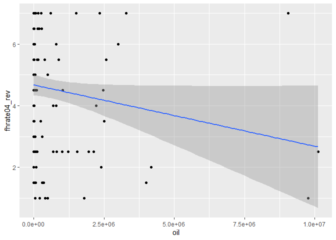

Exercicio 5
================
Vlademir

    ## -- Attaching packages -------------------------------------------------- tidyverse 1.3.0 --

    ## v ggplot2 3.3.2     v purrr   0.3.4
    ## v tibble  3.0.1     v dplyr   1.0.0
    ## v tidyr   1.1.0     v stringr 1.4.0
    ## v readr   1.3.1     v forcats 0.5.0

    ## -- Conflicts ----------------------------------------------------- tidyverse_conflicts() --
    ## x dplyr::filter() masks stats::filter()
    ## x dplyr::lag()    masks stats::lag()

### Existem diversas medidas de democracia para os países: `dem_score14`, `democ11`, `fhrate04_rev`, `fhrate08_rev`, `polity`. Descreva-as graficamente e diga quais são as diferenças entre tais medidas.

<!-- --><!-- --><!-- --><!-- --><!-- -->
\#Com execeção de dem\_score14, todas as demais são escalas fixas que
variam em intervalo específico.

\#Avalie a relação entre todas as medidas de democracia e desigualdade,
utilizando a variável `gini08`. Descreva graficamente esta variável, a
relação entre as duas variáveis, meça a correlação entre elas e faça
regressões lineares (interpretando em profundidade os resultados dos
coeficientes e medidas de desempenho dos modelos). Enfatize as
semelhanças e diferenças entre os resultados. Quais são suas
conclusões?

<!-- -->

    ## 
    ##  Pearson's product-moment correlation
    ## 
    ## data:  banco$gini08 and banco$dem_score14
    ## t = -2.4621, df = 120, p-value = 0.01523
    ## alternative hypothesis: true correlation is not equal to 0
    ## 95 percent confidence interval:
    ##  -0.38215203 -0.04321115
    ## sample estimates:
    ##        cor 
    ## -0.2192877

    ## `geom_smooth()` using formula 'y ~ x'

<!-- -->

    ## 
    ## Call:
    ## lm(formula = dem_score14 ~ gini08, data = banco)
    ## 
    ## Residuals:
    ##     Min      1Q  Median      3Q     Max 
    ## -4.0728 -1.7583  0.3513  1.6742  3.3600 
    ## 
    ## Coefficients:
    ##             Estimate Std. Error t value Pr(>|t|)    
    ## (Intercept)  7.71756    0.75639  10.203   <2e-16 ***
    ## gini08      -0.04448    0.01807  -2.462   0.0152 *  
    ## ---
    ## Signif. codes:  0 '***' 0.001 '**' 0.01 '*' 0.05 '.' 0.1 ' ' 1
    ## 
    ## Residual standard error: 2.003 on 120 degrees of freedom
    ##   (45 observations deleted due to missingness)
    ## Multiple R-squared:  0.04809,    Adjusted R-squared:  0.04015 
    ## F-statistic: 6.062 on 1 and 120 DF,  p-value: 0.01523

\#Comentário: variação positiva no Gini impacta de forma negativa a
democracia. Ou seja com base nos coeficientes registrada, uma acréscimo
de uma unidade em gini08 significa uma récuo de 0,04 em dem\_score14

    ## 
    ##  Pearson's product-moment correlation
    ## 
    ## data:  banco$gini08 and banco$democ11
    ## t = -0.90439, df = 113, p-value = 0.3677
    ## alternative hypothesis: true correlation is not equal to 0
    ## 95 percent confidence interval:
    ##  -0.26378781  0.09988899
    ## sample estimates:
    ##         cor 
    ## -0.08477203

    ## `geom_smooth()` using formula 'y ~ x'

<!-- -->

    ## 
    ## Call:
    ## lm(formula = democ11 ~ gini08, data = banco)
    ## 
    ## Residuals:
    ##    Min     1Q Median     3Q    Max 
    ## -6.796 -2.213  1.302  3.049  3.958 
    ## 
    ## Coefficients:
    ##             Estimate Std. Error t value Pr(>|t|)    
    ## (Intercept)  7.68568    1.38306   5.557 1.85e-07 ***
    ## gini08      -0.02994    0.03311  -0.904    0.368    
    ## ---
    ## Signif. codes:  0 '***' 0.001 '**' 0.01 '*' 0.05 '.' 0.1 ' ' 1
    ## 
    ## Residual standard error: 3.47 on 113 degrees of freedom
    ##   (52 observations deleted due to missingness)
    ## Multiple R-squared:  0.007186,   Adjusted R-squared:  -0.0016 
    ## F-statistic: 0.8179 on 1 and 113 DF,  p-value: 0.3677

\#Comentário: permanace o mesmo tipo de relação verificado no comentário
anterior. Há uma direção negativa entre as duas variáveis. Porém, o
impacto da desigualade é menor. Nota-se que pelos coeficiente que um
acréscimo do GINI impõe um déscrecimo de 0,02 em democ11

    ## 
    ##  Pearson's product-moment correlation
    ## 
    ## data:  banco$gini08 and banco$fhrate04_rev
    ## t = -1.9869, df = 120, p-value = 0.04921
    ## alternative hypothesis: true correlation is not equal to 0
    ## 95 percent confidence interval:
    ##  -0.3452745300 -0.0007294745
    ## sample estimates:
    ##        cor 
    ## -0.1784673

    ## `geom_smooth()` using formula 'y ~ x'

<!-- -->

    ## 
    ## Call:
    ## lm(formula = fhrate04_rev ~ gini08, data = banco)
    ## 
    ## Residuals:
    ##     Min      1Q  Median      3Q     Max 
    ## -3.8312 -1.3896  0.4312  1.6729  2.6199 
    ## 
    ## Coefficients:
    ##             Estimate Std. Error t value Pr(>|t|)    
    ## (Intercept)  6.13654    0.67419   9.102 2.35e-15 ***
    ## gini08      -0.03199    0.01610  -1.987   0.0492 *  
    ## ---
    ## Signif. codes:  0 '***' 0.001 '**' 0.01 '*' 0.05 '.' 0.1 ' ' 1
    ## 
    ## Residual standard error: 1.786 on 120 degrees of freedom
    ##   (45 observations deleted due to missingness)
    ## Multiple R-squared:  0.03185,    Adjusted R-squared:  0.02378 
    ## F-statistic: 3.948 on 1 and 120 DF,  p-value: 0.04921

    ## 
    ##  Pearson's product-moment correlation
    ## 
    ## data:  banco$gini08 and banco$fhrate08_rev
    ## t = -1.7432, df = 119, p-value = 0.08387
    ## alternative hypothesis: true correlation is not equal to 0
    ## 95 percent confidence interval:
    ##  -0.32708386  0.02129614
    ## sample estimates:
    ##        cor 
    ## -0.1578002

    ## `geom_smooth()` using formula 'y ~ x'

<!-- -->

    ## 
    ## Call:
    ## lm(formula = fhrate08_rev ~ gini08, data = banco)
    ## 
    ## Residuals:
    ##     Min      1Q  Median      3Q     Max 
    ## -7.9157 -2.5971  0.6712  3.4091  5.0961 
    ## 
    ## Coefficients:
    ##             Estimate Std. Error t value Pr(>|t|)    
    ## (Intercept)  9.97288    1.34188   7.432 1.79e-11 ***
    ## gini08      -0.05590    0.03207  -1.743   0.0839 .  
    ## ---
    ## Signif. codes:  0 '***' 0.001 '**' 0.01 '*' 0.05 '.' 0.1 ' ' 1
    ## 
    ## Residual standard error: 3.554 on 119 degrees of freedom
    ##   (46 observations deleted due to missingness)
    ## Multiple R-squared:  0.0249, Adjusted R-squared:  0.01671 
    ## F-statistic: 3.039 on 1 and 119 DF,  p-value: 0.08387

    ## 
    ##  Pearson's product-moment correlation
    ## 
    ## data:  banco$polity and banco$gini08
    ## t = -0.43417, df = 113, p-value = 0.665
    ## alternative hypothesis: true correlation is not equal to 0
    ## 95 percent confidence interval:
    ##  -0.2222590  0.1433725
    ## sample estimates:
    ##         cor 
    ## -0.04080936

    ## `geom_smooth()` using formula 'y ~ x'

<!-- -->

    ## 
    ## Call:
    ## lm(formula = polity ~ gini08, data = banco)
    ## 
    ## Residuals:
    ##     Min      1Q  Median      3Q     Max 
    ## -14.374  -1.300   2.364   4.087   5.040 
    ## 
    ## Coefficients:
    ##             Estimate Std. Error t value Pr(>|t|)   
    ## (Intercept)  6.21813    2.20594   2.819  0.00569 **
    ## gini08      -0.02292    0.05280  -0.434  0.66499   
    ## ---
    ## Signif. codes:  0 '***' 0.001 '**' 0.01 '*' 0.05 '.' 0.1 ' ' 1
    ## 
    ## Residual standard error: 5.535 on 113 degrees of freedom
    ##   (52 observations deleted due to missingness)
    ## Multiple R-squared:  0.001665,   Adjusted R-squared:  -0.007169 
    ## F-statistic: 0.1885 on 1 and 113 DF,  p-value: 0.665

\#\#Comentário: em geral, os coeficientes registram a mesma tendência
das regressões anteriores. A diferência reside nos valores e na
significância estatística. Dos três modelos, apenas dois (o primeiro e
o segundo) monstram uma signifância confiável. Então, nesse sentido, há
pouco endosso à hipótese apresentada. Por fim, se deve apontar que a
correlação não é tão forte, pelos resultados dos testes.

# Avalie a relação entre todas as medidas de democracia e crescimento econômico, utilizando a variável `gdppcap08`. Descreva graficamente esta variável, a relação entre as duas variáveis, meça a correlação entre elas e faça regressões lineares (interpretando em profundidade os resultados dos coeficientes e medidas de desempenho dos modelos). Enfatize as semelhanças e diferenças entre os resultados. Quais são suas conclusões?

<!-- -->

    ## 
    ##  Pearson's product-moment correlation
    ## 
    ## data:  banco$gdppcap08 and banco$dem_score14
    ## t = 7.1713, df = 150, p-value = 3.159e-11
    ## alternative hypothesis: true correlation is not equal to 0
    ## 95 percent confidence interval:
    ##  0.3763618 0.6150148
    ## sample estimates:
    ##       cor 
    ## 0.5052872

    ## `geom_smooth()` using formula 'y ~ x'

<!-- -->

    ## 
    ## Call:
    ## lm(formula = dem_score14 ~ gdppcap08, data = banco)
    ## 
    ## Residuals:
    ##     Min      1Q  Median      3Q     Max 
    ## -7.5428 -1.3420  0.6982  1.2843  3.0329 
    ## 
    ## Coefficients:
    ##              Estimate Std. Error t value Pr(>|t|)    
    ## (Intercept) 4.678e+00  2.017e-01  23.197  < 2e-16 ***
    ## gdppcap08   7.040e-05  9.817e-06   7.171 3.16e-11 ***
    ## ---
    ## Signif. codes:  0 '***' 0.001 '**' 0.01 '*' 0.05 '.' 0.1 ' ' 1
    ## 
    ## Residual standard error: 1.864 on 150 degrees of freedom
    ##   (15 observations deleted due to missingness)
    ## Multiple R-squared:  0.2553, Adjusted R-squared:  0.2504 
    ## F-statistic: 51.43 on 1 and 150 DF,  p-value: 3.159e-11

\#Comentário: constata-se uma direção positiva na variação entre as duas
variáveis. Em outras palavras, cada elevação no crescimento econômica
aumenta em 7,04 elavada a 5 o dem\_score14. Importante que há uma
significância estatística elevada a julgar pelo p-valor

    ## 
    ##  Pearson's product-moment correlation
    ## 
    ## data:  banco$democ11 and banco$gdppcap08
    ## t = 3.6037, df = 140, p-value = 0.000435
    ## alternative hypothesis: true correlation is not equal to 0
    ## 95 percent confidence interval:
    ##  0.1330147 0.4351981
    ## sample estimates:
    ##      cor 
    ## 0.291358

    ## `geom_smooth()` using formula 'y ~ x'

<!-- -->

    ## 
    ## Call:
    ## lm(formula = democ11 ~ gdppcap08, data = banco)
    ## 
    ## Residuals:
    ##     Min      1Q  Median      3Q     Max 
    ## -11.258  -3.030   1.723   2.783   4.803 
    ## 
    ## Coefficients:
    ##              Estimate Std. Error t value Pr(>|t|)    
    ## (Intercept) 4.939e+00  4.026e-01  12.270  < 2e-16 ***
    ## gdppcap08   7.359e-05  2.042e-05   3.604 0.000435 ***
    ## ---
    ## Signif. codes:  0 '***' 0.001 '**' 0.01 '*' 0.05 '.' 0.1 ' ' 1
    ## 
    ## Residual standard error: 3.57 on 140 degrees of freedom
    ##   (25 observations deleted due to missingness)
    ## Multiple R-squared:  0.08489,    Adjusted R-squared:  0.07835 
    ## F-statistic: 12.99 on 1 and 140 DF,  p-value: 0.000435

    ## 
    ##  Pearson's product-moment correlation
    ## 
    ## data:  banco$fhrate04_rev and banco$gdppcap08
    ## t = 6.0129, df = 150, p-value = 1.331e-08
    ## alternative hypothesis: true correlation is not equal to 0
    ## 95 percent confidence interval:
    ##  0.3027442 0.5605748
    ## sample estimates:
    ##       cor 
    ## 0.4407043

    ## `geom_smooth()` using formula 'y ~ x'

<!-- -->

    ## 
    ## Call:
    ## lm(formula = fhrate04_rev ~ gdppcap08, data = banco)
    ## 
    ## Residuals:
    ##     Min      1Q  Median      3Q     Max 
    ## -6.0897 -1.4154  0.5914  1.2481  2.9773 
    ## 
    ## Coefficients:
    ##              Estimate Std. Error t value Pr(>|t|)    
    ## (Intercept) 3.828e+00  1.894e-01  20.210  < 2e-16 ***
    ## gdppcap08   5.545e-05  9.222e-06   6.013 1.33e-08 ***
    ## ---
    ## Signif. codes:  0 '***' 0.001 '**' 0.01 '*' 0.05 '.' 0.1 ' ' 1
    ## 
    ## Residual standard error: 1.751 on 150 degrees of freedom
    ##   (15 observations deleted due to missingness)
    ## Multiple R-squared:  0.1942, Adjusted R-squared:  0.1888 
    ## F-statistic: 36.16 on 1 and 150 DF,  p-value: 1.331e-08

\#A diferença dos resultados dessa regressão para as anteriores se
encontram no coeficiente da variável x: o valor de seu impacto é menor
do que os anteriores. Ainda assim, se conserva a direção positiva.

    ## 
    ##  Pearson's product-moment correlation
    ## 
    ## data:  banco$fhrate08_rev and banco$gdppcap08
    ## t = 6.0508, df = 149, p-value = 1.115e-08
    ## alternative hypothesis: true correlation is not equal to 0
    ## 95 percent confidence interval:
    ##  0.3061176 0.5638582
    ## sample estimates:
    ##     cor 
    ## 0.44413

    ## `geom_smooth()` using formula 'y ~ x'

<!-- -->

    ## 
    ## Call:
    ## lm(formula = fhrate08_rev ~ gdppcap08, data = banco)
    ## 
    ## Residuals:
    ##     Min      1Q  Median      3Q     Max 
    ## -12.124  -2.345   1.164   2.510   5.918 
    ## 
    ## Coefficients:
    ##              Estimate Std. Error t value Pr(>|t|)    
    ## (Intercept) 5.698e+00  3.739e-01  15.237  < 2e-16 ***
    ## gdppcap08   1.098e-04  1.814e-05   6.051 1.11e-08 ***
    ## ---
    ## Signif. codes:  0 '***' 0.001 '**' 0.01 '*' 0.05 '.' 0.1 ' ' 1
    ## 
    ## Residual standard error: 3.438 on 149 degrees of freedom
    ##   (16 observations deleted due to missingness)
    ## Multiple R-squared:  0.1973, Adjusted R-squared:  0.1919 
    ## F-statistic: 36.61 on 1 and 149 DF,  p-value: 1.115e-08

\#\#Nesse caso, o impacto em termos de valor é ainda menor, devido ao
coeficiente ser menor do que os registrados anteirormente.

    ## 
    ##  Pearson's product-moment correlation
    ## 
    ## data:  banco$polity and banco$gdppcap08
    ## t = 2.0332, df = 140, p-value = 0.04392
    ## alternative hypothesis: true correlation is not equal to 0
    ## 95 percent confidence interval:
    ##  0.004758504 0.325013386
    ## sample estimates:
    ##      cor 
    ## 0.169353

    ## `geom_smooth()` using formula 'y ~ x'

<!-- -->

    ## 
    ## Call:
    ## lm(formula = polity ~ gdppcap08, data = banco)
    ## 
    ## Residuals:
    ##     Min      1Q  Median      3Q     Max 
    ## -19.426  -4.207   2.847   4.332   6.378 
    ## 
    ## Coefficients:
    ##              Estimate Std. Error t value Pr(>|t|)    
    ## (Intercept) 3.375e+00  6.833e-01   4.940  2.2e-06 ***
    ## gdppcap08   7.047e-05  3.466e-05   2.033   0.0439 *  
    ## ---
    ## Signif. codes:  0 '***' 0.001 '**' 0.01 '*' 0.05 '.' 0.1 ' ' 1
    ## 
    ## Residual standard error: 6.059 on 140 degrees of freedom
    ##   (25 observations deleted due to missingness)
    ## Multiple R-squared:  0.02868,    Adjusted R-squared:  0.02174 
    ## F-statistic: 4.134 on 1 and 140 DF,  p-value: 0.04392

\#\#Comentário: em resumo, há uma direção positiva entre as duas
variáveis. A diferenção entre as regressões rodadas reside no
coeficientes. Em alguns exemplos, o gdppcap008 apresenta um valor maior,
portanto seu impacto também é dimensionado nessa proporção. A
signicância em todos os casos é alta, mais precisamente abaixo de 0,05.
Além disso, deve-se considerar que a desindade da correlação não é muito
forte nos modelos, uma vez que o teste registra valores próximos de 0.

# Avalie a relação entre todas as medidas de democracia e produção de petróleo, utilizando a variável `oil`. Descreva graficamente esta variável, a relação entre as duas variáveis, meça a correlação entre elas e faça regressões lineares (interpretando em profundidade os resultados dos coeficientes e medidas de desempenho dos modelos). Enfatize as semelhanças e diferenças entre os resultados. Quais são suas conclusões?

    ## `stat_bin()` using `bins = 30`. Pick better value with `binwidth`.

<!-- -->

    ## 
    ##  Pearson's product-moment correlation
    ## 
    ## data:  banco$oil and banco$dem_score14
    ## t = -1.6344, df = 163, p-value = 0.1041
    ## alternative hypothesis: true correlation is not equal to 0
    ## 95 percent confidence interval:
    ##  -0.27443572  0.02631799
    ## sample estimates:
    ##        cor 
    ## -0.1269762

    ## `geom_smooth()` using formula 'y ~ x'

<!-- -->

    ## 
    ## Call:
    ## lm(formula = dem_score14 ~ oil, data = banco)
    ## 
    ## Residuals:
    ##    Min     1Q Median     3Q    Max 
    ## -4.574 -1.934  0.144  1.797  4.718 
    ## 
    ## Coefficients:
    ##               Estimate Std. Error t value Pr(>|t|)    
    ## (Intercept)  5.654e+00  1.795e-01  31.503   <2e-16 ***
    ## oil         -1.881e-07  1.151e-07  -1.634    0.104    
    ## ---
    ## Signif. codes:  0 '***' 0.001 '**' 0.01 '*' 0.05 '.' 0.1 ' ' 1
    ## 
    ## Residual standard error: 2.177 on 163 degrees of freedom
    ##   (2 observations deleted due to missingness)
    ## Multiple R-squared:  0.01612,    Adjusted R-squared:  0.01009 
    ## F-statistic: 2.671 on 1 and 163 DF,  p-value: 0.1041

\#Comentário, a julgar pelos coeficientes, se nota um impacto negativo
da produção de petróleo sob a democracia. Cada aumento em oil gera um
decréscimo de 1,88 na variável dem\_score14.

    ## 
    ##  Pearson's product-moment correlation
    ## 
    ## data:  banco$oil and banco$democ11
    ## t = -1.718, df = 142, p-value = 0.08798
    ## alternative hypothesis: true correlation is not equal to 0
    ## 95 percent confidence interval:
    ##  -0.29928445  0.02138076
    ## sample estimates:
    ##        cor 
    ## -0.1426942

    ## `geom_smooth()` using formula 'y ~ x'

<!-- -->

    ## 
    ## Call:
    ## lm(formula = democ11 ~ oil, data = banco)
    ## 
    ## Residuals:
    ##     Min      1Q  Median      3Q     Max 
    ## -6.1387 -3.2230  0.8616  2.8893  6.9421 
    ## 
    ## Coefficients:
    ##               Estimate Std. Error t value Pr(>|t|)    
    ## (Intercept)  6.139e+00  3.259e-01  18.837   <2e-16 ***
    ## oil         -3.402e-07  1.980e-07  -1.718    0.088 .  
    ## ---
    ## Signif. codes:  0 '***' 0.001 '**' 0.01 '*' 0.05 '.' 0.1 ' ' 1
    ## 
    ## Residual standard error: 3.685 on 142 degrees of freedom
    ##   (23 observations deleted due to missingness)
    ## Multiple R-squared:  0.02036,    Adjusted R-squared:  0.01346 
    ## F-statistic: 2.951 on 1 and 142 DF,  p-value: 0.08798

    ## 
    ##  Pearson's product-moment correlation
    ## 
    ## data:  banco$oil and banco$fhrate04_rev
    ## t = -1.9244, df = 150, p-value = 0.0562
    ## alternative hypothesis: true correlation is not equal to 0
    ## 95 percent confidence interval:
    ##  -0.306837012  0.004083069
    ## sample estimates:
    ##        cor 
    ## -0.1552185

    ## `geom_smooth()` using formula 'y ~ x'

<!-- -->

    ## 
    ## Call:
    ## lm(formula = fhrate04_rev ~ oil, data = banco)
    ## 
    ## Residuals:
    ##     Min      1Q  Median      3Q     Max 
    ## -3.6658 -1.7613  0.3246  1.8334  4.1268 
    ## 
    ## Coefficients:
    ##               Estimate Std. Error t value Pr(>|t|)    
    ## (Intercept)  4.675e+00  1.663e-01  28.109   <2e-16 ***
    ## oil         -1.990e-07  1.034e-07  -1.924   0.0562 .  
    ## ---
    ## Signif. codes:  0 '***' 0.001 '**' 0.01 '*' 0.05 '.' 0.1 ' ' 1
    ## 
    ## Residual standard error: 1.934 on 150 degrees of freedom
    ##   (15 observations deleted due to missingness)
    ## Multiple R-squared:  0.02409,    Adjusted R-squared:  0.01759 
    ## F-statistic: 3.703 on 1 and 150 DF,  p-value: 0.0562

    ## 
    ##  Pearson's product-moment correlation
    ## 
    ## data:  banco$oil and banco$fhrate08_rev
    ## t = -1.8779, df = 149, p-value = 0.06235
    ## alternative hypothesis: true correlation is not equal to 0
    ## 95 percent confidence interval:
    ##  -0.304387817  0.007867529
    ## sample estimates:
    ##       cor 
    ## -0.152052

    ## `geom_smooth()` using formula 'y ~ x'

<!-- -->

    ## 
    ## Call:
    ## lm(formula = fhrate08_rev ~ oil, data = banco)
    ## 
    ## Residuals:
    ##     Min      1Q  Median      3Q     Max 
    ## -7.3506 -3.3777 -0.3643  3.6243  8.0856 
    ## 
    ## Coefficients:
    ##               Estimate Std. Error t value Pr(>|t|)    
    ## (Intercept)  7.378e+00  3.286e-01  22.449   <2e-16 ***
    ## oil         -3.824e-07  2.037e-07  -1.878   0.0624 .  
    ## ---
    ## Signif. codes:  0 '***' 0.001 '**' 0.01 '*' 0.05 '.' 0.1 ' ' 1
    ## 
    ## Residual standard error: 3.808 on 149 degrees of freedom
    ##   (16 observations deleted due to missingness)
    ## Multiple R-squared:  0.02312,    Adjusted R-squared:  0.01656 
    ## F-statistic: 3.526 on 1 and 149 DF,  p-value: 0.06235

    ## 
    ##  Pearson's product-moment correlation
    ## 
    ## data:  banco$oil and banco$polity
    ## t = -2.195, df = 142, p-value = 0.02979
    ## alternative hypothesis: true correlation is not equal to 0
    ## 95 percent confidence interval:
    ##  -0.33480603 -0.01811182
    ## sample estimates:
    ##        cor 
    ## -0.1811511

    ## `geom_smooth()` using formula 'y ~ x'

<!-- -->

    ## 
    ## Call:
    ## lm(formula = polity ~ oil, data = banco)
    ## 
    ## Residuals:
    ##     Min      1Q  Median      3Q     Max 
    ## -13.890  -4.906   2.248   4.505  11.681 
    ## 
    ## Coefficients:
    ##               Estimate Std. Error t value Pr(>|t|)    
    ## (Intercept)  4.752e+00  5.327e-01   8.922 2.09e-15 ***
    ## oil         -7.105e-07  3.237e-07  -2.195   0.0298 *  
    ## ---
    ## Signif. codes:  0 '***' 0.001 '**' 0.01 '*' 0.05 '.' 0.1 ' ' 1
    ## 
    ## Residual standard error: 6.024 on 142 degrees of freedom
    ##   (23 observations deleted due to missingness)
    ## Multiple R-squared:  0.03282,    Adjusted R-squared:  0.026 
    ## F-statistic: 4.818 on 1 and 142 DF,  p-value: 0.02979

## Comentário: Em todos os casos se revelam os mesmos padrões. Há um relação direção negativa entre democracia e produção de petroléo. O elemento diferenciador em cada situação está nos coeficientes. Em algumas, registra-se um impacto de oil maior, mas há que se considerar também a variação na significância estatística, que, a depender das variáveis testas, vai de altamente (no caso, oil e polity) a pouco significativo (no caso, oil e dem\_score14). Soma-se a magnitude da correlação é bastante fraca, com indíces próximos 0 em todos os casos.

### Avalie a relação entre crescimento econômico e produção de petróleo. Descreva a relação entre as duas variáveis, meça a correlação entre elas e faça regressões lineares (interpretando em profundidade os resultados dos coeficientes e medidas de desempenho dos modelos). Enfatize as semelhanças e diferenças entre os resultados. Quais são suas conclusões?

    ## 
    ##  Pearson's product-moment correlation
    ## 
    ## data:  banco$oil and banco$gdppcap08
    ## t = 2.3051, df = 149, p-value = 0.02254
    ## alternative hypothesis: true correlation is not equal to 0
    ## 95 percent confidence interval:
    ##  0.02661893 0.33534756
    ## sample estimates:
    ##       cor 
    ## 0.1855584

    ## 
    ## Call:
    ## lm(formula = gdppcap08 ~ oil, data = banco)
    ## 
    ## Residuals:
    ##    Min     1Q Median     3Q    Max 
    ## -15541 -10735  -6347   6549  70967 
    ## 
    ## Coefficients:
    ##              Estimate Std. Error t value Pr(>|t|)    
    ## (Intercept) 1.262e+04  1.319e+03   9.566   <2e-16 ***
    ## oil         1.884e-03  8.173e-04   2.305   0.0225 *  
    ## ---
    ## Signif. codes:  0 '***' 0.001 '**' 0.01 '*' 0.05 '.' 0.1 ' ' 1
    ## 
    ## Residual standard error: 15280 on 149 degrees of freedom
    ##   (16 observations deleted due to missingness)
    ## Multiple R-squared:  0.03443,    Adjusted R-squared:  0.02795 
    ## F-statistic: 5.313 on 1 and 149 DF,  p-value: 0.02254

\#\#Comentário: os coeficientes mostram um relação positiva entre as
duas variáveis. Ou seja, acréscimos na produção de petróleo geram
elevações no desempenho econômico. Essa correlação é apoaida pelo
p-valor. Há uma significancia estatística considerável, que se encontra
entre 0,01 e 0,05. Porém, a correlação tem uma densidade fraca, posto
que apresenta um valor próximo de 0.

### A partir das suas conclusões sobre a relação entre democracia, economia e produção de petróleo, quais considerações são possíveis fazer sobre a relação CAUSAL entre estas variáveis? Lembre dos 4 “hurdles” do livro *Fundamentals of Political Science Research*

# R: Com bases nos resultados dos testes, é difícil apontar há um mecanismo causas entres essas variaveis, essa constatação requer mais elaborações. Primeiro, não se pode confirmar que há produção de petroleo isoladamente gera crescimento econômico, sendo importanteo levar em contras outras variáveis. Da mesma forma, a relação entre fatores econômicas e democracia precisa de mais endosso. Embora a maiora das democracias sejam desenvolvidas, há outros fatores que influenciam essa equação conforme demonstra a literatura. Por fim, o vincúlo entre petróleo e democracia não pode dispensar mais elaboração. É patente que o primeiro produz impacto sob o segundo, mas não há como apontar firmamente que esse efeito é causal.

\`\`\`
