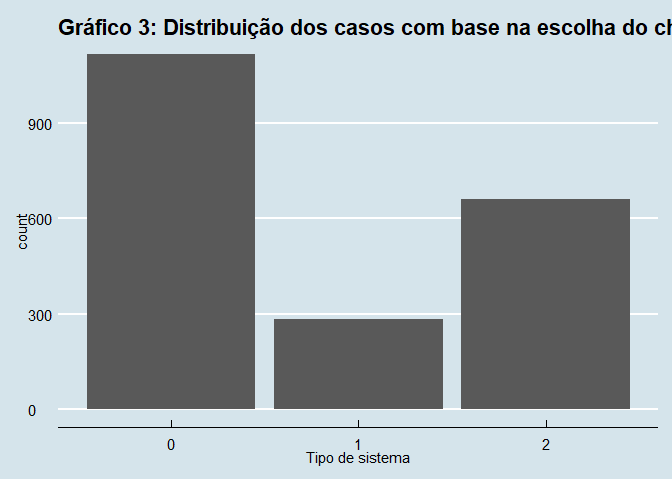
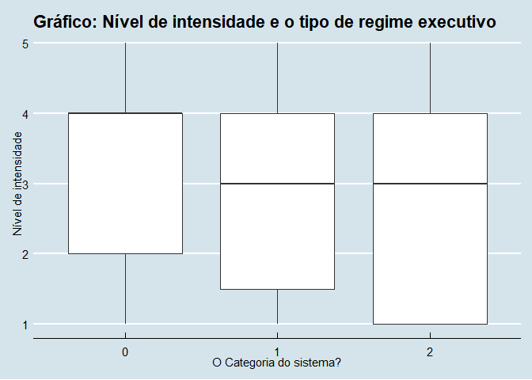

Trabalho
================

link1 \<-
“<https://github.com/vladmonteiro/Analise-de-dados/blob/master/MID.dta>”

download.file(link1, “MID.dta”, mode = “cw”)

bancoMID \<- read\_dta(“MID.dta”)

``` r
library(haven)

setwd("C:\\Users\\vlade\\Downloads") 

banco_militar <-read_dta("MID.dta")

read_dta("MID.dta")
```

    ## # A tibble: 5,558 x 20
    ##    dispnum3 dispnum4 stabb ccode stday stmon styear endday endmon endyear sidea
    ##       <dbl>    <dbl> <chr> <dbl> <dbl> <dbl>  <dbl>  <dbl>  <dbl>   <dbl> <dbl>
    ##  1        2       -9 UKG     200    -9     7   1902     24      1    1903     0
    ##  2        2       -9 USA       2    -9     7   1902     24      1    1903     1
    ##  3        3       -9 YUG     345     2     5   1913     25     10    1913     0
    ##  4        3       -9 AUH     300     2     5   1913     25     10    1913     1
    ##  5        4       -9 ALB     339    15     5   1946     13     11    1946     1
    ##  6        4       -9 UKG     200    15     5   1946     13     11    1946     0
    ##  7        7       -9 UKG     200    13    10   1951     26      1    1952     1
    ##  8        7       -9 EGY     651    13    10   1951     26      1    1952     0
    ##  9        8       -9 IRN     630    -9     7   1856     14      3    1857     0
    ## 10        8       -9 UKG     200    -9     7   1856     14      3    1857     1
    ## # ... with 5,548 more rows, and 9 more variables: revstate <dbl>,
    ## #   revtype1 <dbl>, revtype2 <dbl>, fatality <dbl>, fatalpre <dbl>,
    ## #   hiact <dbl>, hostlev <dbl>, orig <dbl>, version <dbl>

``` r
write_dta(banco_militar, "MID.dta")
```

link2 \<-
“<https://github.com/vladmonteiro/Analise-de-dados/blob/master/DPI2017.dta>”

download.file(link2, “DPI2017.dta”, mode = “cw”)

bancoDPI \<- read\_dta(“DPI2017.dta”)

``` r
library(haven)
library(tidyverse)
```

    ## -- Attaching packages ----------------------------------------------------------- tidyverse 1.3.0 --

    ## v ggplot2 3.3.2     v purrr   0.3.4
    ## v tibble  3.0.1     v dplyr   1.0.2
    ## v tidyr   1.1.2     v stringr 1.4.0
    ## v readr   1.4.0     v forcats 0.5.0

    ## -- Conflicts -------------------------------------------------------------- tidyverse_conflicts() --
    ## x dplyr::filter() masks stats::filter()
    ## x dplyr::lag()    masks stats::lag()

``` r
banco_politica <-read_dta("C:\\Users\\vlade\\Downloads\\DPI2017.dta")

banco_politica <- banco_politica %>%
   mutate(ifs = recode(ifs, 
                           AGO = "ANG",
                           ARE = "UAE",
                           AUS = "AUL", 
                           AUT = "AUS",
                           BDI = "BUI", 
                           BFA = "BFO", 
                           BGR = "BUL",
                           BGD = "BNG",
                           BHS = "BHM",
                           BRB = "BAR",
                           BWA = "BOT",
                           CAF = "CEN",
                           CMR = "CAO",
                           COG = "CON", 
                           CPV = "CAP",
                           CRI = "COS",
                           DEU = "GMY", 
                           DNK = "DEN",
                           DZA = "ALG", 
                           ESP = "SPN",
                           FRA = "FRN", 
                           GBR = "UKG", 
                           GEO = "GRG",
                           GIN = "GUI",
                           GTM = "GUA",
                           GMB = "GAM",
                           GNQ = "EQG",
                           GRD = "GRN", 
                           GTA = "GUA", 
                           HTI = "HAI",
                           HND = "HON",
                           HRV = "CRO", 
                           IDN = "INS", 
                           IRL = "IRE", 
                           KAZ = "KZK", 
                           KGZ = "KIR",
                           LCA = "SLU",
                           LKA = "SRI",
                           LSO = "LES", 
                           LBN = "LEB",
                           MMR = "MYA",
                           MOZ = "MZM",
                           MNG = "MON",
                           KHM = "CAM",
                           NZL = "NEW",
                           NPL = "NEP",
                           NLD = "NTH",
                           NGA = "NIG",
                           NER = "NIR",
                           MWI = "MAW",
                           MUS = "MAS",
                           MRT = "MAS",
                           MKD = "MAC",
                           MDV = "MAS", 
                           MDG = "MAG", 
                           MDA = "MLD",
                           LVA = "LAT", 
                           MYS = "MAL",
                           PHL = "PHI",
                           PRT = "POR",
                           PRY = "PAR",
                           SLE = "SIE",
                           SGP = "SIN",
                           SWE = "SWD",
                           SVN = "SLV",
                           SVK = "SLO",
                           ZAF = "SAF",
                           ZMB = "ZAM", 
                           YSR = "YUG", 
                           TTO = "TRI",
                           THA = "THI",
                           TMP = "ETM", 
                           TCD = "CHA",
                           SUN = "RUS",
                           TGO = "TOG",
                           TZA = "TAZ",
                           TWN = "TAW",
                           URY = "URU",
                           ZAR = "CON", 
                           ZWE = "ZIM")) %>%
  
filter(oppvote!=-999, military!=-999, system!=-999, legelec!=-999, exelec!=-999) %>% 
  mutate(military = as.factor(military)) %>%
  mutate(system = as.factor(system)) %>%
  mutate(legelec = as.factor(legelec)) %>%
  mutate(exelec = as.factor(exelec)) 

banco_MP <- inner_join(banco_militar, banco_politica, 
                           by = c("styear" = "year", "stabb" ="ifs"))
```

link3 \<-
“<https://github.com/vladmonteiro/Analise-de-dados/blob/master/growth.xls>”

download.file(link3, “growth.xls”, mode = “cw”)

bancoGROWTH \<- read\_excel(“growth.xls”)

``` r
library(readxl)


banco_crescimento <-read_excel("C:\\Users\\vlade\\Downloads\\growth.xls")


banco_crescimento <- banco_crescimento %>%
pivot_longer(!countrycode, names_to = "year", values_to = "growth") %>%
mutate(year = as.numeric(year)) %>%
mutate(countrycode = recode(countrycode, 
                           AGO = "ANG",
                           ARE = "UAE",
                           AUS = "AUL", 
                           AUT = "AUS",
                           BDI = "BUI", 
                           BFA = "BFO", 
                           BGR = "BUL",
                           BGD = "BNG",
                           BHS = "BHM",
                           BRB = "BAR",
                           BWA = "BOT",
                           CAF = "CEN",
                           CMR = "CAO",
                           COG = "CON", 
                           CPV = "CAP",
                           CRI = "COS",
                           DEU = "GMY", 
                           DNK = "DEN",
                           DZA = "ALG", 
                           ESP = "SPN",
                           FRA = "FRN", 
                           GBR = "UKG", 
                           GEO = "GRG",
                           GIN = "GUI",
                           GTM = "GUA",
                           GMB = "GAM",
                           GNQ = "EQG",
                           GRD = "GRN", 
                           GTA = "GUA", 
                           HTI = "HAI",
                           HND = "HON",
                           HRV = "CRO", 
                           IDN = "INS", 
                           IRL = "IRE", 
                           KAZ = "KZK", 
                           KGZ = "KIR",
                           LCA = "SLU",
                           LKA = "SRI",
                           LSO = "LES", 
                           LBN = "LEB",
                           MMR = "MYA",
                           MOZ = "MZM",
                           MNG = "MON",
                           KHM = "CAM",
                           NZL = "NEW",
                           NPL = "NEP",
                           NLD = "NTH",
                           NGA = "NIG",
                           NER = "NIR",
                           MWI = "MAW",
                           MUS = "MAS",
                           MRT = "MAS",
                           MKD = "MAC",
                           MDV = "MAS", 
                           MDG = "MAG", 
                           MDA = "MLD",
                           LVA = "LAT", 
                           MYS = "MAL",
                           PHL = "PHI",
                           PRT = "POR",
                           PRY = "PAR",
                           SLE = "SIE",
                           SGP = "SIN",
                           SWE = "SWD",
                           SVN = "SLV",
                           SVK = "SLO",
                           ZAF = "SAF",
                           ZMB = "ZAM", 
                           YSR = "YUG", 
                           TTO = "TRI",
                           THA = "THI",
                           TMP = "ETM", 
                           TCD = "CHA",
                           SUN = "RUS",
                           TGO = "TOG",
                           TZA = "TAZ",
                           TWN = "TAW",
                           URY = "URU",
                           ZAR = "CON", 
                           ZWE = "ZIM"))
```

``` r
banco <- inner_join(banco_MP, banco_crescimento, 
                by = c("stabb" = "countrycode", "styear"="year"))
```

``` r
##Problematização 

###Há uma extensa literatura nas Relações Internacionais dedicada a abordar o uso da força na arena global. Parte desses estudos examina o fenômeno sob a perspectiva dos mandatários. A problemática central nessa agenda de pesquisa pode ser resumida em um questionamento: por que os líderes decidem se engajar em condutas arriscadas e beligerantes? As respostas a indagação têm variado entre problematizações de cunho teórico, enquanto que outras com foco mais empírico. Nesta última categoria se enquanto trabalhos como o de Horowitz et al (2005), o quais exploraram, a partir de uma abordagem quantitativa, a relação entre a idade dos governantes e as disputas militarizadas (MID). O propósito é evidenciar o impacto geracional sob o início e a escalada de ações beligerantes. Entre os resultados encontrados, constata-se uma maior probabilidade de chefes de Estados mais velhos em desencadear e intensificar as MID, em razão da incerteza de quantos anos permanecerão no cargo Na contramão desses achados, governantes jovens, ainda nos primórdios de sua carreira, evitam manobras aventureiras a fim de não liquidar seu futuro político. Ainda no âmbito das análises biológicas, pode-se mencionar o trabalho de Koch e Fulton (2011), que examina a influência do gênero no gasto em defesa e no comportamento beligerante dos Estados. Também empregando métodos quantitativos, os autores conseguem observar que as mulheres em cargos executivos tendem adotar uma postura agressiva no que diz respeito ao uso dos meios militares.  Nessas situações, o cargo ocupado exerce um efeito mais condicionante sob a definição da conduta do que o próprio gênero. Ao assumirem um posto de liderança, os indivíduos do sexo feminino buscam driblar a percepção estereotipada que lhes a atribuem um perfil sensível ou menos firme do que os homens. 
###Outros autores se debruçam sob elementos subjetivos não biológicos, a exemplo da experiência profissional. Secher (2004) investiga a tese da suposta prudência de governantes com uma carreira militar prévia. A premissa basilar desse argumento é que incumbentes advindos das Forças Armadas apresentam um maior moderação do que os civis quando se trata de embarcar em campanhas externas. O estudioso encontra evidências que provam o contrário. A cautela não é de forma alguma inata aos militares: a incorporação dessa atitude depende dos constrangimentos de natureza institucional. Um forte controle civil sob suas atividades refreia-os de incorrer em comportamentos agressivos no teatro internacional. Adicionando um outra nuance à essa problemática, Horowitz e Stam (2012) chamam atenção ao impacto do histórico de combate dos líderes. Através de testes empíricos, eles conseguem constar que a passagem pelo campo de batalha opera como inibidor sob as ações dos dirigentes. Ainda dentro dessa agenda, Barceló (2018) discute como a educação incute certos valores e a repercussão disso na tomada de decisão em situações de crises. Ele defende que governantes cuja formação ocorreu em instituições de ensino nas democracias ocidentais adotam comportamentos conciliatórias, e, por conseguintes, tendem a preferir resoluções pacíficas a respostas beligerantes. A formação educacional na condição de procedimento socializante transmite às elites estrangeiras um conjunto de normas específicas, que posteriormente se tornam seus referenciais. De fato, os achados do autor confirmam a hipótese. É menos provável que autoridades com um diploma obtido em universidades da Europa ou dos Estados se envolvem em conflitos do que aqueles formados em seus próprios países. 
###Nota-se que, do ponto de vista analítico, os líderes enquanto objeto ocupam uma posição central na construção do esquema argumentativo dos trabalhos acima. A proeminência conceitual atribuída a eles não se dá de maneira alguma por acaso. Na verdade, os atores mencionados são expoentes de uma corrente que identifica nesses indivíduos uma força causal. Dessa maneira, a compreensão não só de certas escolhas em momentos de crises, mas também da política externa passa pelo escrutínio cientifico de seu principal tomador de decisão. Apesar do destaque conquistado no campo de pesquisa, essa escola compete com uma outra que minimiza a relevância analítica desses agentes. Para os aderentes dessa perspectiva, suas escolhas não são autônomas ou blindadas de elementos alheios. Por conseguinte, o foco desses estudiosos reside nos fatores externos ao mandatário que permeiam o processo decisório e a formulação de políticas e estratégias. Nesse sentido, a agenda elaborada por eles insere variáveis políticas e institucionais para analisar o comportamento estatal. E por que incorporá-las? Os proponentes da abordagem dizem que elas são responsáveis por condicionar os outcomes, no caso em questão, o uso da força. 
### Um exemplo de teoria tributária dessa escola é a da guerra diversionária. Levy  (1989) aponta a popularidade dessa leitura entre os teóricos internacionalistas das diferentes matizes: tanto aqueles adeptos das abordagens qualitativas quanto seus correligionários quantitativas frequentemente recorrem a ele no intuito de fornecer explicações às ocorrências desse fenômeno. A premissa basilar desse argumento postula que os chefes do executivo capitalizam o envolvimento em conflitos externos para fins domésticos. Dito de outro modo, quando a situação interna é marcada pela deterioração do quadro econômico, erosão do apoio à classe dominante e insatisfação política, os governantes lançam mão de manobras externas para desviar atenção do público em relação aos problemas nacionais e de sua má gestão em resolver estes. Além disso, eles também se beneficiariam dos impulsos à coesão coletiva – o chamado efeito rally around flag – gerado por esse tipo de ação. Diante de ameaças,  a identidade grupal tende a ser reforçada e, mais importante, reforçam a lealdade dos cidadãos para com líderes, além de moderar oposição de setores sociais a suas políticas (MITCHEL, PRINS, 2004). 
###A execução da estratégia diversionária depende de certas circunstâncias. Nesse ponto essa teoria se aproxima da vertente institucionalista. O regime político de um país pode inibir ou viabilizar a postura agressiva. Em virtude disso, se difunde uma premissa que democracias seriam mais propensas às posições conciliatórias do que as autocracias. O elemento chave nisso é o arcabouço institucional em torno da qual se estrutura o poder nos países liberais. Schultz destaca as idiossincrasias inibidoras da democracia. De um lado, sua qualidade competitiva elava os custos políticos de incorrer em manobras militares sem garantias de êxito; por outro, o sistema de pesos e contrapesos horizontaliza a tomada de decisão, de modo confere poder de veto a players cujas preferências podem não convergir com aquelas do incumbente. Há uma literatura que corrobora com esses argumentos: Brulé (2006) fornece evidências sobre o papel refreador do legislativo às pretensões beligerante dos chefes do executivo. Tomando os Estados Unidos como estudo de caso, ele constata que o domínio do Congresso pela oposição arrefece às investidas externas do presidente. Até mesmo em um contexto de crise econômica, o espaço de manobra dele é menor. No entanto, essa tese é de forma alguma livre de contestações. Outras análises sugerem que a inclinação pacifista garantida pelas instituições democráticas carece de respaldo. Davies (2006) revela que a prudência no uso da força não é inerente aos países que adotam sistemas pluralistas. Verifica-se que os líderes nesses casos se mostram tão dispostos – ainda em que menor frequência – a incorrem em ofensivas militares quanto aqueles de regimes autoritários. 
###Pickering e Kasangani (2005) consideram que o tratamento dado à variável institucional expões algumas deficiências do campo. Em face disso, se faz necessário uma melhor problematização conceitual de regime de modo que se fuja da dicotomia e acomode as nuances de como o poder é organizado. Nesse sentido, a literatura poderia obter ganhos substantivos se incorporasse o grau de amadurecimento das estruturas, independentemente de sua natureza. A depender da consolidação das instituições, os incentivos ao uso da força variam. Essa abordagem mostra resultados, na medida não somente corrobora e rejeita alguns argumentos largamente difundidos, mas também proporciona uma leitura mais completa sobre a relação entre os regimes e a adoção de posturas beligerantes. Ente os achados, a suposta agressividade das autocracias é contestada, posto que naquelas onde há um forte controle do líder sob o aparato governamental, ele se mostra menos propensos a embarcar em missões militares diante da insatisfação da audiência doméstica. Por outro lado, os países democráticos, sejam aqueles com instituições sólidas ou aqueles que não alçaram um estágio de desenvolvimento avançado, os problemas econômicos parecem não ter peso na disposição dos líderes em condutas agressivas. Em contrapartida, em países politicamente mais debilitados, em as instituições ainda se encontram em vias de consolidação, há incentivos para o uso da força. 
###A partir do que foi exposto anteriormente, fica claro que existe uma literatura extensa sobre o uso da força nas Relações Internacionais, ainda ela que a construção dos esquemas argumentativos se concentre em duas dimensões – os líderes e as instituições. Contudo, pode-se apontar há uma problematização incipiente a respeito da variável dependente. Geralmente, os estudos tendem a tratá-la apenas como uma ocorrência histórica, sem apontar suas nuances. Dado essa lacuna, este trabalho se propõe a introduzir uma outra leitura sobre o emprego dos meios militares enquanto variável dependente. O ponto de partida é o entendimento sobre o uso da força difundido nas RI. É importante ter em conta que esse fenômeno se manifesta de maneira um tanto diversa, compreendendo desde a ameaça em assumir uma postura beligerante ao combate de fato. O foco então aqui é lançar luz à essa variação, ou seja, explicar por que, em alguns casos, a violência estatal contra alvos externos é mais ou menos branda. Pretende-se analisar o problema por uma perspectiva que combina os aspectos institucionais e políticos apontados acima. Nesse sentido, o trabalho subscreve ao argumento de que as instituições e certas questões de ordem política servem de constrangimento ao modo como se emprega as capacidades bélicas. A escolha desse formado de maneira alguma indica um descrédito à corrente orientada ao líder. No entanto, embora os traços subjetivos dos atores envolvidos pesem sob a tomada de decisões, elementos de ordem estrutural, a exemplo do regime, duração de mandato, articulação política etc., condicionam o processo e, mais importante, o espaço de ação daqueles em posição de comando. 

##Desenho de pesquisa e operacionalização 
###Da literatura revisada anteriormente, se extrai os conceitos que fundamentam a formulação das hipóteses que este estudo pretende testar. Procura-se examinar a correlação de três variáveis com o fenômeno em tela. A começar pelos constrangimentos institucionais, se escolhe o tipo de regime como proxy.  Sua influência sob o uso da força é respaldada por vários estudos. Porém, em vez classificação dicotômica, que costuma dividir os países de acordo com sua aderência ou não aos parâmetros democráticos, prefere-se aqui, seguindo as recomendações de Pickering e Kasangani (2005), uma outra formulação que se baseia nos procedimentos de escolha do chefe do executivo. A depender de formato de sua eleição, ele pode dispor de mais ou menos poderes para assumir políticas beligerantes. 

###H1: Quanto mais direta for a escolha do chefe do executivo, maior a intensidade do uso da força.  

###A segunda variável se refere a um constrangimento político, para ser mais preciso, ao ciclo eleitoral. Conforme indica a teoria da guerra diversionária, os dirigentes buscam capitalizar o envolvimento em contendas internacionais para fins políticos. Sua intenção é tirar algum ganho dessa estratégia. Nesse sentido, a instrumentalização dos meios militares pode muitas vezes atender finalidades eleitorais (GAUBATZ, 1991). Motivados pelo anseio de permanecer no poder, esses atores buscam tirar proveito do efeito rally around the flag a fim de ampliar suas chances de vitória nos pleitos. Nesse sentido, espera-se que eles adotem posturas mais agressivas que impulsione a coesão social e a lealdade dos governados a eles, como previsto pela teoria da guerra diversionária. 

###H1: A realização de eleição, seja executiva ou legislativa, no ano de deflagração da disputa eleva a intensidade do uso da força.   

###Por fim, a terceira hipótese trata da atuação dos setores oposicionistas enquanto constrangimento a atitudes agressivas. Deve se considerar esse elemento, porque a margem de manobra do incumbente para adotar posturas agressivas pode variar a depender do apoio que ele dispõe no legislativo. Uma oposição forte significa certamente dificuldades políticas para obter o respaldo legal à execução de incursões no exterior. Portanto, espera-se, em sintonia com Brulé (2006), Fordham (2002), Howell e Pevehouse (2005), que a oposição modere a intensidade do uso da força. 

###H2: A oposição ao governo gera um efeito negativo na intensidade do uso da força. Quanto maior apoio a oposição dispor no legislativo, menor a intensidade do uso da força.

###O trabalho emprega três bancos de dados. Um deles é o MID (Militarized Interstate Dispustes), compilado pelo Projeto Correlates of War. O MID reúne ocorrências desde 1816.  Pickering e Kisangani apresentam algumas ressalvas a esse banco, sobretudo devido a seu escopo limitado. Ele apenas agrega casos cujas partes envolvidas sejam Estados do Sistema Internacional, excluindo eventos envolvendo governos contra atores não-estatais. Apesar disso, prefere-se empregá-lo porque compartilho da visão realista que trata os Estados como principais atores na arena global. O segundo banco utilizado é o DPI (Database of Political Institutions), formulado pelo Banco Interamericano de Desenvolvimento. Ele agrupa dados sobre instituições, eleições, partidos etc. de 180 países entre1975 e 2017.  Por fim, o terceiro banco é o GDP Growth, elaborado pelo Banco Mundial. Ele traz a porcentagem de crescimento da economia de mais de 190 países de 1961 a 2019. 

##Variáveis dependente  
###A variável depende é o nível de hostilidade das disputas (codificada como hostlev), do banco MID. Essa escolha se efetua em consonância com o objetivo de fugir da abordagem tradicional, que normalmente não fornece leituras complexas e profundas sob o objeto a ser explicado. A variável é o do tipo contínua, que vai de uma escala de 1 e 5. Cada unidade corresponde o seguinte: 1 – nenhuma ação militarizada; 2 – ameaça do uso da força; 3 – display da força; 4 – uso da força; 5 – guerra. A mensuração da varável dependente se dá na dimensão espacial. Ou seja, a preocupação não reside em seu comportamento ao longo de um período de tempo, mas nas diferenças delas em cada unidade física, no casos, os Estados que compõem o Sistema Internacional. 

##Variáveis independentes       
###Para operacionalizar a Hipótese 1 escolhe-se um preditor categórico, especificamente o sistema de governo. Essa variável (codificada no DPI como system) classifica os regimes em conformidade com o procedimento de escolha do chefe do executivo. Há três categorias: parlamentarista (2); presidente eleito por assembleia (1); presidencial (0). Faz-necessário salientar que o DPI não omite os países não democráticos. Esses entram na categoria 0. O preditor da Hipótese 2 é a realização de eleições no ano da contenda militar. Serão consideradas tantas as eleições legislativas (codificada como legelec) quanto as executivas (condificada como exelec). Havendo eleições, será atribuído o valor 1; caso não ocorram pleitos no ano de deflagração da contenda, a variável receberá o valor 0. Por fim, a Hipótese 3 será testada com uma variável do tipo contínua – a porcentagem de votos obtidos pelos partidos oposicionistas. 

##Varáveis de controle
###O modelo incorpora variáveis de controle que lidam com temas distintos. Elas expressão explicações concorrentes à que está sendo postulado neste trabalho. Uma delas se inspira no argumento econômico da guerra diversionária. Em razão de sua incapacidade de apresentar soluções a crises econômicas, eles embarcam em ofensivas militares com o intuito de desviar a atenção da população desses problemas. A operacionalização disso se dá por meio de uma variável contínua que mede a porcentagem de crescimento anual do PIB. Esses registros são retirados de um banco de dados copilado pelo Banco Mundial, que reúnes informações de mais de 180 países desde 1961. 
###A segunda variável de controle se inspira nas discussões sobre a relação dos militares e a adoção de posturas beligerantes no ambiente externo, quando esses estão em posições de liderança política. A revisão literária feita antes mencionou perspectivas com resultados divergentes, alguns dos quais colocam em dúvida certas premissas. Aqui, a mensuração desse conceito ocorre através da presença de fardados no topo da hierarquia executiva. Para tal, empregam-se a variável categórica extraídas do DPI (codificada como military). Se o chefe do executivo é um das Forças Armadas, o valor será 1. Caso contrário, será 0. 

##Validade e Confiabilidade
###Conceitualmente, a validade diz respeito a correspondência entre os conceitos e as variáveis que os mesura. Nesse sentido, o trabalho não incorre em muitas inconsistências, posto que lança mão de proxies frequentemente adotadas na literatura. Por exemplo, o tipo de regime é um dos principais operacionalizadores quando se procura investigar a influência das instituições na política externa. Por sua vez, a mensuração dos constrangimentos políticos através de eleições e do tamanho de apoio da oposição também é comum. Da mesma maneira, estudiosos, não raro, recorrem à taxa de crescimento do PIB para sob avaliar a situação econômica de um país. Quanto à variável dependente, medir a intensidade das posturas beligerantes dos países através do nível de hostilidade talvez não seja a maneira mais adequada, no entanto, dada a inexistência de um índice, essa variável consegue atender as demandas do trabalho. 
###Por sua vez, a confiabilidade se refere a consistência da mensuração. O trabalho atende essa exigência, posto que cada banco empregado utiliza critérios fixos para medir os dados. Então, a título de ilustração, a forma como se constata a agressividade dos Estados Unidos em uma disputa não se difere daquela aplicada para medir o nível de violência que a Argentina direciona contra um alvo externo. Os resultados, obviamente, podem não ser iguais. No entanto, se submete os casos aos mesmos parâmetros.  
```

``` r
library(ggthemes)
## Representação gráfica das variáveis 

###Variáveis contínuas

### Sendo do tipo contínua, a variável dependente pode ser representada por meio de um histograma. Nota-se que a maioria dos casos se concentra em níveis intermediários de violência e, curiosamente, poucos desembocam em uma guerra. Chama atenção também o número de casos em que ocorre a preferência por nenhuma ação militar.   

ggplot(banco, aes(hostlev)) + geom_histogram(bins = 12) + theme_economist()+
labs(title = "Gráfico 1: Distribuição dos casos de acordo com o nível de hostilidade",
     x = "Nível de hostilidade", y = "Nº de dispustas")
```

<!-- -->

``` r
ggplot(banco, aes(growth)) + geom_boxplot() + theme_economist()+
labs(title = "Gráfico 2: % Crescimento econômico")
```

    ## Warning: Removed 126 rows containing non-finite values (stat_boxplot).

<!-- -->

``` r
# Variáveis categórias

# As variáveis categóricas, a exemplo de sistema político ou a ocupação do executivo por militares, podem ser representadas por gráficos de barras, conforme ilustrado abaixo. A figura indica que a maioria das observações da amostra ocorrem em países que adotam o sistema executivo de natureza presidencial.  


ggplot(banco, aes(system)) + geom_bar() + theme_economist()+
labs (title = "Gráfico 3: Distribuição dos casos com base na escolha do chefe do executivo", x = "Tipo de sistema")
```

<!-- -->

``` r
# No gráfico a seguir, Observa-se que, em menos de um terço dos casos, o executivo é o ocupado por oficiais das Forças Armadas. Esse dado contesta a propensão das democracias à posturas pacíficas ou conciliatórias, postulada na tese da paz democrática.

ggplot(banco, aes(military)) + geom_bar() + theme_economist() +
labs (title = "Gráfico 4: Ocupação da chefia do executivo por militares", x = "Chefe do executivo é um oficial militar?")
```

<!-- -->

``` r
# O próximo gráfico representa a distribuição de casos tendo como critério a realização de eleições legislativa e executiva. Fica evidente que a maioria esmagadora das ocorrências não se manifesta durante ciclos eleitorais. 

ggplot(banco, aes(legelec)) + geom_bar()+ theme_economist() +
labs (title = "Gráfico 5: Distribuição de casos por eleição legislativa", y = "Número de dispustas", x = "Ocorreram eleições executivas no ano da dispusta?") 
```

<!-- -->

``` r
ggplot(banco, aes(exelec)) + geom_bar()  + theme_economist() +

labs (title = "Gráfico 6: Distribuição de casos por eleição executiva", y = "Número de dispustas", x = "Ocorreram eleições legislativa no da dispusta?")
```

<!-- -->

``` r
library(ggplot2)
library(ggthemes)


# Representação gráfica de análises entre variáveis e teste de hipótese

# Esta sessão do trab alho se dedica a dois propósito: 1) a representação gráfica da relação entre cada variável independente e a variável depedente; 2) ao teste de hipótese/correlação. vale recordar que o teste de hipótese serve para avaliar a relação postulada entre as variáveis e, com isso, realizar inferências.  


# Nível de hostilidade x sistema
# Observa-se uma diferença entre os tipos de sistema executivo na intesidade do emprego do poder militar. Países presidencialistas parecem ser mais agressivos do que os demais. A média da intensidade nesses casos corroabora com essa constatação.  Por sua vez, os regimes parlamentaritas e com eleição indireta para presidente adotam posturas não tão beligerantes. Por fim, se verifica uma indisposição à guerra em todas as categorias de sistema. 

ggplot(banco, aes(system, hostlev)) +
geom_boxplot() + theme_economist()+
labs (title = "Gráfico: Nível de intensidade e o tipo de regime executivo", x = "O Categoria do sistema?" , y = "Nível de intensidade" )
```

<!-- -->

``` r
## Uma vez que, nessa hipótese, a variável independente é categórica e ao mesmo tempo um fator de três nívels, o teste mais adequado é o de Kruskal. O resultado aprenseta um p valor significativo, o que sugere a probabilidade de haver uma correlação de sistema com o nível de hostilidade das contendas militares. Isso por si só não é suficiente para avaliar a correlação, faz-se necessário submeter a hipótese ao teste de Wilcoxon, que compara os níveis desse fator. Os resultados apontam que 1) há uma maior probabilidade de ser verdadeira a relação de hostlev com sistema executivo eleito por assembleia do que com executivo presidencialista; 2) há uma maior probabilidade de existir uma associação de hostlev com sistem parlamentarista do que com sistema presidencialsita; 3) é mais provável a correlação de hostlev com o executivo parlamentarista do que com o executivo indicado por assembleia. 

kruskal.test(hostlev ~ system, data = banco)
```

    ## 
    ##  Kruskal-Wallis rank sum test
    ## 
    ## data:  hostlev by system
    ## Kruskal-Wallis chi-squared = 28.021, df = 2, p-value = 8.229e-07

``` r
pairwise.wilcox.test(banco$hostlev, banco$system,
                     p.adjust.method = "BH")
```

    ## 
    ##  Pairwise comparisons using Wilcoxon rank sum test with continuity correction 
    ## 
    ## data:  banco$hostlev and banco$system 
    ## 
    ##   0       1    
    ## 1 0.301   -    
    ## 2 4.1e-07 0.011
    ## 
    ## P value adjustment method: BH

``` r
# Nivel de hostilidade x eleições 

## O gráfico aponta que não há diferenças consideráveis entre dispustas ocorridas no ano de eleições executivas e aquelas fora do período eleitoral. A média da intensidade é a mesma nos dois conjuntos e a maioria das observações não escala para comportamentos mais beligerantes. Porém, deve se observar que alguns casos fora do ciclo eleitoral registram uma postura agressiva, beirando o conflito de fato. 

ggplot(banco, aes(exelec, hostlev)) +
geom_boxplot() + theme_economist()+
labs (title = "Gráfico: Nível de intensidade e a realização de eleições executivas", x = "Ocorreu eleições executivas no ano da dispusta?" , y = "Nível de intensidade" )
```

<!-- -->

``` r
## Uma vez que, nessa hipótese, a variável independente é categórica, deve-se submetê-la ao teste t. Os resultados monstram que o p-valor não  é significativo, logo  pode se apontar que a hipótese deve ser rejeitada em favor da hipótese nula, ou seja, há pouca probailidade de se averiguar uma relação causal entre o nível de hostilidade e a realização de eleições.

t.test(banco$hostlev ~banco$exelec, data = banco)
```

    ## 
    ##  Welch Two Sample t-test
    ## 
    ## data:  banco$hostlev by banco$exelec
    ## t = 0.90276, df = 211.59, p-value = 0.3677
    ## alternative hypothesis: true difference in means is not equal to 0
    ## 95 percent confidence interval:
    ##  -0.1025999  0.2759738
    ## sample estimates:
    ## mean in group 0 mean in group 1 
    ##        2.938960        2.852273

``` r
## O gráfico abaixo converge em um aspecto com o anterior. Em especifico, boa parcela das observações ocorrem fora do ciclo de eleições para o legislativo. Nesse conjunto, a intesidade tende a ser predominatemente moderada. Nos casos sucedidos em anos de pleito para o parlamento, nota-se que a postura oscila entre um tom moderado e agressivo.     

ggplot(banco, aes(legelec, hostlev)) +
geom_boxplot() + theme_economist()+
labs (title = "Gráfico: Nível de intensidade e a realização de eleições legislativas", x = "Ocorreu eleições legislativas no ano da dispusta?" , y = "Nível de intensidade" )
```

<!-- -->

``` r
## Se repete aqui a mesma constatação do teste anterior. O p-valor é marginalmente significativo. Portanto, não é possível rejeitar completamente a hipótese nula. Dito de outro modo, é baixa da probabilidade de exisitr uma relação entre nível de hostilidade e realização de eleições legislativas. 

t.test(banco$hostlev ~banco$legelec, data = banco)
```

    ## 
    ##  Welch Two Sample t-test
    ## 
    ## data:  banco$hostlev by banco$legelec
    ## t = -0.65766, df = 712.53, p-value = 0.511
    ## alternative hypothesis: true difference in means is not equal to 0
    ## 95 percent confidence interval:
    ##  -0.17310154  0.08623094
    ## sample estimates:
    ## mean in group 0 mean in group 1 
    ##        2.922318        2.965753

``` r
# Nivel de hostilidade x % de votos da oposição
## O gráfico ilustra que o papel refreador da oposição sob o uso da força é ambíguo. Por um lado, quando essa variável oscila entre  40% e 60%, a intensidade da aplicação do poder militar não escala para níveis altamente beligerantes; por outro, nesse mesmo intervalo, existem observações de posturas agressivas, acima de 4, e até mesmo, guerras. Isso indica que setores oposicionistas podem apoiar políticas ofensivas em vez coibi-las. 

ggplot(banco, aes(oppvote, hostlev)) +
geom_jitter() + theme_economist()+
labs (title = "Gráfico: Nível de intensidade e oposição  ", x = "% de votos da oposição" , y = "Nível de intensidade" )
```

<!-- -->

``` r
## Aqui o teste mais adequado é o R de Pearson, posto que a variável independente é contínua. O p-valor altamente significativo favorece a hipótese postulada em detrimento da hipótese nula. Logo, é muito provável que a % de votos obtidas pela oposição influencie a intesidade do uso da força. 

cor.test(banco$oppvote, banco$hostlev)
```

    ## 
    ##  Pearson's product-moment correlation
    ## 
    ## data:  banco$oppvote and banco$hostlev
    ## t = -7.5556, df = 2058, p-value = 6.234e-14
    ## alternative hypothesis: true correlation is not equal to 0
    ## 95 percent confidence interval:
    ##  -0.2060139 -0.1219655
    ## sample estimates:
    ##        cor 
    ## -0.1642879

``` r
# Nível de hostiidade x % de crescimento econômico 
## A partir da representação gráfica dessa relação, observa-se que baixo crecimento econômico não incentiva o uso da força, seja qual for a intesidade. Uma parcela considerável dos comportamentos mais agressivos - inclusive a maioria das guerras registradas - ocorre em situações de punjança econômica. A constatação contrapõe-se à literatura, que frequentemente aponta recessões como elmento deflagador de incursões externas. Deve-se atentar que o gráfico aponta a presença de alguns outliers.  

ggplot(banco, aes(growth, hostlev)) +
geom_jitter()+
labs (title = "Gráfico: Nível de intensidade e % crescimento econômico  ", x = "% crescimento econômico" , y = "Nível de intensidade" )
```

    ## Warning: Removed 126 rows containing missing values (geom_point).

<!-- -->

``` r
## Aqui o teste mais adequado é o teste R de Pearson, posto que a variável independente é contínua. Deve se considerar dois elementos para avaliar a correlação aqui. Um dele é O próprio p-valor, que registra uma significância estatística baixa. Logo, a correlaçao é improvável. E o outro é o intervalo de confiança. Dado que ele passa por 0, não se pode rejeitar a hipótese nula. 

cor.test(banco$growth, banco$hostlev)
```

    ## 
    ##  Pearson's product-moment correlation
    ## 
    ## data:  banco$growth and banco$hostlev
    ## t = 0.18293, df = 1932, p-value = 0.8549
    ## alternative hypothesis: true correlation is not equal to 0
    ## 95 percent confidence interval:
    ##  -0.04041834  0.04872555
    ## sample estimates:
    ##         cor 
    ## 0.004161877

``` r
# Nível de hostilidade x chefia do executivo por militares
### A partir do gráfico, percebe-se que na maioria das observções o executivo é controlado por civis. Nesse grupo, a média do intesidade do uso da força indica uma preferência por atitudes não beligerantes. Por outro, no grupo que contém os registros de países comandados por militares, predomina a adoção de posturas violentas. 

ggplot(banco, aes(military, hostlev)) +
geom_boxplot() + theme_economist()+
labs (title = "Gráfico: Nível de intensidade e a chefia do executivo por militares  ", x = "O chefe do executivo é militar?" , y = "Nível de intensidade" )
```

<!-- -->

``` r
## Nesse caso, o teste mais adquado é o teste T, já que a variável independenete é categórica. Os resultados apontam uma alta siginificância estatística. Consequentemente, pode se inferir que é muito provável a existência de uma correlação entre a intesidade e a a chefia do executivo por militares. 

t.test(banco$hostlev ~banco$military, data = banco)
```

    ## 
    ##  Welch Two Sample t-test
    ## 
    ## data:  banco$hostlev by banco$military
    ## t = -5.7882, df = 606.45, p-value = 1.141e-08
    ## alternative hypothesis: true difference in means is not equal to 0
    ## 95 percent confidence interval:
    ##  -0.5247162 -0.2588578
    ## sample estimates:
    ## mean in group 0 mean in group 1 
    ##        2.857570        3.249357

``` r
library(dotwhisker)
##Regressão 

### Visto que a variável dependente é o do tipo contínua, o modelo emprega a técnica de regressão linear para averiguar a relação de causalidade com as variáveis independentes. Matematicamente, a regressão pode ser expressa na seguinte equação:        

options (scipen = 10)

rgr <- lm(hostlev ~ system + exelec  + legelec  + oppvote  + growth + military, data = banco, na.action = na.omit)

summary (rgr)
```

    ## 
    ## Call:
    ## lm(formula = hostlev ~ system + exelec + legelec + oppvote + 
    ##     growth + military, data = banco, na.action = na.omit)
    ## 
    ## Residuals:
    ##     Min      1Q  Median      3Q     Max 
    ## -2.4471 -1.4692  0.3532  0.8950  2.4507 
    ## 
    ## Coefficients:
    ##               Estimate Std. Error t value   Pr(>|t|)    
    ## (Intercept)  3.1162286  0.0531303  58.653    < 2e-16 ***
    ## system1     -0.1758936  0.0903698  -1.946    0.05175 .  
    ## system2     -0.1392973  0.0706842  -1.971    0.04890 *  
    ## exelec1     -0.1715491  0.1028806  -1.667    0.09559 .  
    ## legelec1     0.1217115  0.0701510   1.735    0.08290 .  
    ## oppvote     -0.0074158  0.0013913  -5.330 0.00000011 ***
    ## growth       0.0003674  0.0039289   0.094    0.92550    
    ## military1    0.2068328  0.0776256   2.664    0.00777 ** 
    ## ---
    ## Signif. codes:  0 '***' 0.001 '**' 0.01 '*' 0.05 '.' 0.1 ' ' 1
    ## 
    ## Residual standard error: 1.22 on 1926 degrees of freedom
    ##   (126 observations deleted due to missingness)
    ## Multiple R-squared:  0.03901,    Adjusted R-squared:  0.03552 
    ## F-statistic: 11.17 on 7 and 1926 DF,  p-value: 0.00000000000006363

``` r
confint(rgr, level =0.95)
```

    ##                    2.5 %        97.5 %
    ## (Intercept)  3.012029597  3.2204276629
    ## system1     -0.353126465  0.0013393201
    ## system2     -0.277922800 -0.0006717236
    ## exelec1     -0.373318233  0.0302200966
    ## legelec1    -0.015868442  0.2592914470
    ## oppvote     -0.010144515 -0.0046871793
    ## growth      -0.007337865  0.0080727549
    ## military1    0.054593835  0.3590717796

``` r
### A começar pelo p-valor, todas as variáveis, com exceção de crescimento econômico (growth), apresentam uma significância estatística alta. Observa-se que a intesidade do emprego dos meios militares tende ser 3 (display da força), quando todos os preditores apresentam valor 0. Em comparação aos países presidencialistas, os países com sistema onde executivo é indicado por assembleia e parlamentarista aplicam o poder militar de maneira menos intensa.A adoção do parlamentaarismo substrai em 0,139 a intensidade, enquanto que a indicação do chefe executivo por uma assembleia diminui em 0,175. Já a realização de eleição para o cargo executivo no ano de deflagração da dispusta pode reduzir em 0,171 a intesidade da força quando comparada a não ocorrência de um pleito. Em contraste a esses resultados, quando a disputa se sucede em um ano de eleição legislativa,  a intesidade se eleva em 0,121 em comparação a uma dipusta deflagrada fora do ciclo eleitoral. A oposição produz um efeito negativo sob a variável dependente. Nesse sentido, cada acréscimo em sua % de votos obtidos significa uma contração de 0,007 na intesidade. Por sua vez, O crescimento econômico impacta positivamente na intensidade. Um aumento unitário nesse índice gera um adição de 0,0003 na intesidade. Porém, essa estimativa é desprezível em razão de seu valor quase nulo e, consequentemente, por causa da significância estatística baixa. Finalmente, a chefia do cargo executivo por militares também gera um efeito positivo sob a variável dependente. Ou seja, quando um membro das forças armadas está no comando do país, a intesidade com que os meios militares são aplicados é 0,206 maior em relaçao a um governo capitaneado por civis. 

### Um outro aspecto ao qual se deve atentar é o r², dado que esse indica a capacidade do modelo em explicar a variação da viarável y. Aqui o r² corresponde a 0,039. E o que isso significa na prática? Idealmente, um modelo perfeito apresentaria um coeficiente de determinação igual a 1. Nesse sentido, ele seria capaz de elucidar a totalidade da variância de y. No entanto, em ciências sociais raramente se consegue tal façanha. Nota-se que no modelo apresentado nesse trabalho, o valor do r está muito longe desses critérios. Ele só se mostra adquado para explicar apenas 3,9% da variação na intesidade da aplicação das capacidades militares. Esse valor é ruim? Não, necessariamente. Um r² baixo não atesta a falta de qualidade do modelo, o que justificaria seu descarte. Tampouco, um valor alto para esse índice não demostra que o modelo é perfeito. 

## Intervalo de confiança e erro padrão ;
### Dado que não é possível saber exatamente a média das variáveis para a população em geral,  pode-se ter uma estimativa disso com  o intervalo de confiança (com nível de confiança de 95% como é convencionalmente adotado), calculado a partir do erro padrão. Nota-se que os coeficientes estimados das variáveis do modelo estão dentro dos intervalos. Porém, é importante também observar que alguns coeficientes (system2; legelec1; growth) representados no gráfico que cruzam o zero. Isso significa que não há confiabilidade de que eles possam representam as médias da população. 

confint(rgr, level =0.95)
```

    ##                    2.5 %        97.5 %
    ## (Intercept)  3.012029597  3.2204276629
    ## system1     -0.353126465  0.0013393201
    ## system2     -0.277922800 -0.0006717236
    ## exelec1     -0.373318233  0.0302200966
    ## legelec1    -0.015868442  0.2592914470
    ## oppvote     -0.010144515 -0.0046871793
    ## growth      -0.007337865  0.0080727549
    ## military1    0.054593835  0.3590717796

``` r
dwplot(rgr, vline = geom_vline(xintercept = 0, colour = "black", linetype = 5))
```

<!-- -->

``` r
## A contribuição da pesquisa 
### O trabalho traz iimportantes apontamentoso sobre a literatura na qual se baseou a formulação das hipóteses. Primeiro, a motivação econômica dos conflitos - argumento da guerra diversionária - é rejeitada pelo resultado da regressão. Os regimes importam? Sim, porém alguns mais do que os outros. Em linhas gerais, a capacidade de empreender ações militares varia a depender da estruturação de poder em cada sistema. O presidencialismo se mostra mais agressivo do que os demais. Talvez o que explica isso é a menor quantidade de veto players. Nesses casos, a prerrogativa de usar os meios bélicos cabe quase exclusiva e formalmente ao presidente. Então, ele enfrenta poucos obstáculos para adotar condutas agressivas. Num país parlamentatista, o premiê precisa dispor de uma maioria ou angariar o apoio de seus pares para lançar a cabo ofensivas. Terceiro, a suposta prudência dos militares também é contestada. O modelo mostra que, quando eles ocupam a chefia do executivo, posturas beligerantes tendem a ser a regra, e não a exceção. Logo, não se deve esperar uma aplicação moderada das capacidades bélicas por parte deles, mas sim uma escalada.Por fim, o peso das eleições é ambiguo. O uso eleitoral dos conflitos é alvo de debate na literatura, o trabalho feito aqui sugere que a corrida para o executivo e para o parlamento não produzem repercurssões semelhantes. E por que? Pode-se inferir que políticas agressivas em um um ciclo eleitoral legislativo sirva para ampliar a base dos incumbentes. Por outro lado, se ele busca releição ou emplacar seu substituto, ofensivas violentas talvez tenham um efeito negativo, devido aos custos que envolvem e a incertza quando ao resultado. 


### Representaçã gráfica com mais de duas variáveis

## Como o modelo se baseia em uma regressão multivariada, pode-se fazer gráficos com mais de duas varíaveis. Vejamos alguns exemplos

## Nível de intesidade x Oposição x Regime executivo 
### Esse gráfico chama atenção por dois aspectos. Primeiro, nos sistemas parlamentaristas, uma oposição forte não inibe o uso da força. Pelo contrário, esses eventos são comuns quando esses grupos detém um amplo apoio político. Segundo, as posturas agressivas em paises presidencialistas ocorrem quando a oposiçao não desfruta de uma base forte. 
ggplot(banco, aes(oppvote, hostlev)) + 
geom_jitter()  +   facet_wrap(vars(system))+
labs (title = "Gráfico: Nível de intensidade e oposição  ", x = "% de votos da oposição" , y = "Nível de intensidade" )
```

<!-- -->

``` r
### Nível de intesidade x crescimento econômico x eleição executiva 
### Conforme já mostrado em outras figuras, as observações ocorrem majoritariamente em momentos de expansão produtiva e fora do ciclo eleitoral executivo. No entanto, os casos que coincidem com pleitos acontecem quando há crescimento econômico e neles o uso da força alcaçam níveis agreessivos.  
ggplot(banco, aes(growth, hostlev, color = exelec)) +
geom_jitter()+
labs (title = "Gráfico: Nível de intensidade e % crescimento econômico  ", x = "% crescimento econômico" , y = "Nível de intensidade" )
```

    ## Warning: Removed 126 rows containing missing values (geom_point).

<!-- -->

``` r
### Nível de intesidade x crescimento econômico x eleição legislativa
### Aqui se repete um quadro parecido com o gráfico anterior. Porém, há mais casos de posturas beligerantes em períodos eleitorais legislativos. Chama atenção também que algumas dessas observações ocorrem quando a economia atravessa crises. 

ggplot(banco, aes(growth, hostlev, color = legelec)) +
geom_jitter()+
labs (title = "Gráfico: Nível de intensidade e % crescimento econômico  ", x = "% crescimento econômico" , y = "Nível de intensidade" )
```

    ## Warning: Removed 126 rows containing missing values (geom_point).

<!-- -->

``` r
## Interação 
### Nenhum fenômeno social apresenta causa única. Via de regras, há diversos fatores que influenciam sua manifestaçãoo. Mas isso não quer dizer que todos as causas exercem o mesmo "peso" sob a variável dependente. Uma forma de se averiguar isso em termos estatísticos é através das interações. As interações feitas aqui envolvem as variáveis independentes que registram uma significância estatística expressiva (oppvote, system e miitary) na regressão anterior. Os resultados indicam que: 1) em um sistema no qual o executivo é eleito por uma assembleia, cada aumento na % de voto da oposição diminue em 0,004 a intesidade do uso da força, em comparação a um país presidencialista; 2) em um regime parlamentarista, cada acréscimento unitária na % de votos da oposição 0,001 o nível de violência aplicado externamente em relação a um sistema presidencialista; 3) cada ganho na % de votos da oposição eleva em 0,005 a agressividade com que se emprega os meios miilitares, quando o executivo é comandao por um militar. Nenhuma das interações apresenta significância estatística, no entanto, o modelo de regressão executado reforça que oppvote e military são os principais preditores de hostlev. Exelec e legelec mantém a significância estatística, mas system perde. 


rgr0 <- lm(hostlev ~ system + exelec  + legelec  + oppvote  + growth + military + system*oppvote + oppvote*military, data = banco, na.action = na.omit)
summary(rgr0)
```

    ## 
    ## Call:
    ## lm(formula = hostlev ~ system + exelec + legelec + oppvote + 
    ##     growth + military + system * oppvote + oppvote * military, 
    ##     data = banco, na.action = na.omit)
    ## 
    ## Residuals:
    ##     Min      1Q  Median      3Q     Max 
    ## -2.4305 -1.4124  0.3557  0.8929  2.4606 
    ## 
    ## Coefficients:
    ##                      Estimate  Std. Error t value Pr(>|t|)    
    ## (Intercept)        3.10721213  0.05666733  54.833  < 2e-16 ***
    ## system1           -0.13143791  0.10365991  -1.268 0.204961    
    ## system2           -0.10891765  0.11130270  -0.979 0.327915    
    ## exelec1           -0.17661670  0.10328489  -1.710 0.087428 .  
    ## legelec1           0.12139069  0.07046201   1.723 0.085089 .  
    ## oppvote           -0.00675280  0.00194277  -3.476 0.000521 ***
    ## growth             0.00002319  0.00395741   0.006 0.995325    
    ## military1          0.20171338  0.08611937   2.342 0.019269 *  
    ## system1:oppvote   -0.00476620  0.00540644  -0.882 0.378115    
    ## system2:oppvote   -0.00119977  0.00298206  -0.402 0.687486    
    ## oppvote:military1  0.00154546  0.00522838   0.296 0.767575    
    ## ---
    ## Signif. codes:  0 '***' 0.001 '**' 0.01 '*' 0.05 '.' 0.1 ' ' 1
    ## 
    ## Residual standard error: 1.22 on 1923 degrees of freedom
    ##   (126 observations deleted due to missingness)
    ## Multiple R-squared:  0.03947,    Adjusted R-squared:  0.03448 
    ## F-statistic: 7.902 on 10 and 1923 DF,  p-value: 0.000000000001479

``` r
library(lmtest)
```

    ## Loading required package: zoo

    ## 
    ## Attaching package: 'zoo'

    ## The following objects are masked from 'package:base':
    ## 
    ##     as.Date, as.Date.numeric

``` r
library(MASS)
```

    ## 
    ## Attaching package: 'MASS'

    ## The following object is masked from 'package:dplyr':
    ## 
    ##     select

``` r
library(car)
```

    ## Loading required package: carData

    ## 
    ## Attaching package: 'car'

    ## The following object is masked from 'package:dplyr':
    ## 
    ##     recode

    ## The following object is masked from 'package:purrr':
    ## 
    ##     some

``` r
# Pressupostos da regressão: avaliando o modelo

### O objetivo de uma regressão é elaborar um modelo científico que seja capaz de predizer os resultados. No entanto, em virtude das idiossincrasias das ciências sociais, nem sempre é possível . Em vez disso, as ferramentas metodológicas disponíveis, a exemplo da regressão, contribuem na  um repertório  explicativo aos fenõmenos da realidae. Alcançar tal finalidade requer do modelo formulado atender a certos critérios, chamados de pressupostos da regressão. Analisemos cada um deles abaixo.

## Linearidade 
### O primeiro deles - talvez o mais elementar - é o da lineraidade. Pressume que não haja uma padrão na distribuição dos resíduos. Através do gráfico de dispersão, ilustrado abaixo, percebe-se o pressuposto não é respeitado, uma vez que os resíduos se encontram distribuidos de maneira uniforme.     

plot(rgr, 1)
```

<!-- -->

``` r
## Homocedasticidade 
### Outro princípio diz respeito à homocedasticidade, que se refere a variância uniforme dos resíduos. Quando não satisfeito, ele compromete os testes de significância e os intervalos de confiança. Para averiguá-lo, usa-se aqui dos instrumentos, o gráfio e o teste Breusch-Pagan. Nota-se pela representação gráfico que o pressuposto não é atendido, pois a linha em vermelho não descreve uma trajetória horizontal. Os resultados do teste endossam essa contastação, posto que o p-valor é maior do que 0,05.  

plot(rgr, 3)
```

<!-- -->

``` r
bptest(rgr)
```

    ## 
    ##  studentized Breusch-Pagan test
    ## 
    ## data:  rgr
    ## BP = 9.7627, df = 7, p-value = 0.2024

``` r
ncvTest(rgr)
```

    ## Non-constant Variance Score Test 
    ## Variance formula: ~ fitted.values 
    ## Chisquare = 3.216816, Df = 1, p = 0.072885

``` r
#Autocorrelação 
### O terceiro pressuposto é a ausência de autocorrelação entre as observações/erros. Igual ao príncípio anterior, sua não observância pode prejudicar os testes de significância e  os intervalos de confiança. Gráficos e testes formais, como a estatística Durbin-Watson, servem para avaliar a autocorrelação. O gráfico feito a partir da função acf indica que o princípio não é atendido pelo modelo, na medida em que as linhas verticais em preto cruzam as linhas azuis na horizontal. Os resultados do teste também corroboram esse apontamento, pois apresenta um p-valor maior que > 0,05    

acf(rgr$residuals)
```

<!-- -->

``` r
dwtest(rgr)
```

    ## 
    ##  Durbin-Watson test
    ## 
    ## data:  rgr
    ## DW = 2.0357, p-value = 0.7789
    ## alternative hypothesis: true autocorrelation is greater than 0

``` r
## Normaliidade dos resíduos

### Esse pressuposto, quando violado, implica em uma estimativa enviesada do valor do parâmetro populacional. É possível utilizar tanto um gráfico como um teste formal para examinar esse pressuposto. O gráfico mostra que o modelo viola o pressuposto, pois as observações deveriam estar ao longo da linha tracejada. No entanto, os resultados do teste indicam que o modelo respeita o princípio, em razão do p-valor alto. 

plot(rgr, 2)
```

<!-- -->

``` r
resd <- studres(rgr)
shapiro.test(resd)
```

    ## 
    ##  Shapiro-Wilk normality test
    ## 
    ## data:  resd
    ## W = 0.88074, p-value < 2.2e-16

``` r
### Um desdobramento desse pressuposto é a verificação de outliners. 

plot(rgr,4)
```

<!-- -->

``` r
plot(rgr, 5)
```

<!-- -->

``` r
outlierTest(rgr)
```

    ## No Studentized residuals with Bonferroni p < 0.05
    ## Largest |rstudent|:
    ##       rstudent unadjusted p-value Bonferroni p
    ## 1480 -2.013572           0.044193           NA

``` r
## Ausência de multicolinearidade
### Esse pressuposto presume que não haja uma correlaão entre as variáveis independentes usadas no modelo. Quando não respeitado, ele prejudica a consistência das estimativas. Para testá-lo, pode-se lançar mão da função vif. Não existe paramêtros unanimamente aceitos para avaliar os resultados, no entanto, alguns estudiosos admitem que valores menores do que 4 atendem ao pressuposto. Logo, pode-se dizer que o modelo deste trabalho resepita ao príncipio, uma vez que os valores se encontram abaixo de 4.    

vif(rgr)
```

    ##              GVIF Df GVIF^(1/(2*Df))
    ## system   1.446469  2        1.096673
    ## exelec   1.138059  1        1.066799
    ## legelec  1.102308  1        1.049908
    ## oppvote  1.380756  1        1.175056
    ## growth   1.028236  1        1.014020
    ## military 1.153140  1        1.073843

``` r
##Avaliação dos 4 hurdles  

## 1 - Existe um mecanismo causal convincente que conecta X a Y? 
###Depende da variável X do modelo. A literatura sobre regime mostra que há uma relação entre uso da força e arranjo institucional. Deve-se destacar nesse sentido a tese da paz democrática. Os países democráticos seriam menos agressivos em sua política externa por causa dos constrangimentos de suas instituições e do funcionamento da política doméstica (parlamento, deliberações, barganha, capacidade da oposição de bloquear medidas etc.). Na esteira disso, não há equivoco em apontar uma ligação entre o uso da força e a oposição ao governo no âmbito doméstico. As estruturas políticas e a própria divisão de poderes suprem os partidos e os setores fora do governo com mecanismos para vetar iniciativas. Igualmente pode-se dizer que eleições incentivam posturas agressivas na arena externa, visto que os conflitos ampliam a possibilidade de colher ganhos nas urnas em razão do efeito rally around, sobretudo quando se obtém vitória no front. 
## 2- Podemos descartar a possibilidade de que é Y que causa X?
###Sim. É improvável que a intensidade seja responsável por causar o regime político; a realização de eleições quando estas seguem um calendário preestabelecidos ou, ainda, da oposição ao governo.  
## 3 - Existe covariação entre x e Y?
###Depende da variável independente. Os testes de hipóteses mostram que existe uma correlação entre a intensidade do uso da força e algumas variáveis independentes (especificamente, oppvote, e military), porém em outros casos, essa condição não se faz presente.  
## 4 - Foi possível controlar pelas possíveis variáveis Z que podem alterar a relação entre X e Y?
###Sim. A regressão atestou que, mesmo na presença de variáveis de controle, algumas das variáveis independentes produzem um efeito sob a variável dependente.  Até mesmo quando se executou uma regressão com interações, a significância estatística de oppvote, legelec, exeleg e military se manteve expressiva. 

## Referências 
### HOROWITZ, M. et. al. How Prior Military Experience Influences the Future Militarized Behavior of Leaders. International Organization, v. 68, n. 3, pp. 527-559, 2014.
### BARCELÓ, J. Are Western-Educated Leaders Less Prone to Initiate Militarized Disputes? British Journal of Political Science, v. 50, n. 2, pp. 535-566, 2020.
### BRULE, D. Congressional Opposition, the Economy, and U.S. Dispute Initiation, 1946-2000. Journal of Conflict Resolution, v. 50, n. 4, pp. 463-483, 2006.
### DAVIES, G. Domestic Strife and the Initiation of International Conflicts. Journal of Conflict Resolution, v. 46, n. 5, pp. 672-692, 2002.
### GAUBATZ, K. Election Cycles and War. Journal of Conflict Resolution, v. 35, n. 2, pp. 212-244, 1991. 
### HOWELL, W.; PEVEHOUSE, J. Presidents, Congress, and the Use of Force. International Organization, v. 59, n. 1, pp. 209-232, 2005. 
### KISANGANI, E.; PICKERING, J. Democratic Accountability and Diversionary Force: Regime Types and the Use of Benevolent and Hostile Military Force. Journal of Conflict Resolution, v. 55, n.6, pp. 1021-1046, 2011.
### KOCH, M.; FULTON, S. In the Defense of Women: Gender, Office Holding, and National Security Policy in Established Democracies. The Journal of Politics, v. 73, n. 1, pp. 1-16, 2011.
### LEVY, J. The Diversionary Theory of War: a critique. In MIDLARSKY, M. (eds). Handbook of War Studies. Boston: Unwin Hyman, 1989;
### MITCHEL, S.; PRINS, B. Rivalry and Diversionary Uses of Force. Journal of Conflict Resolution, v. 48, n. 6, pp. 937-961, 2004. 
### PICKERING, J.; KISANGANI, E. Democracy and Diversionary Military Intervention: Reassessing Regime Type and the Diversionary Hypothesis. International Studies Quartely, v. 49, pp. 23-43, 2005.
### PRINS, B.; SPRECHER, C. Institutional Constraints, Political Opposition, and Interstate Dispute Escalation: Evidence from Parliamentary Systems, 1946–89. Journal of Peace Research, v. 36, n. 3, pp. 271-287, 1999.
### SECHER, T. Are Soldiers Less War-Prone than Statesmen? Journal of Conflict Resolution, v. 48, n. 5, pp. 746-774, 2004.
```
