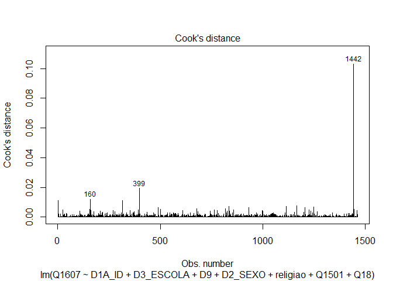

Exercicio 11
================

``` r
library(tidyverse)
library(haven)
library(lmtest)
library(car)

link <- "https://github.com/MartinsRodrigo/Analise-de-dados/blob/master/04622.sav?raw=true"

download.file(link, "04622.sav", mode = "wb")

banco <- read_spss("04622.sav") 

banco <- banco %>%
  mutate(D10 = as_factor(D10)) %>%
  filter(Q1607 < 11, 
         Q18 < 11,
         D9 < 9999998,
         Q1501 < 11)


Outras <- levels(banco$D10)[-c(3,5,13)]

banco <- banco %>%
  mutate(religiao = case_when(D10 %in% Outras ~ "Outras",
                              D10 == "Católica" ~ "Católica",
                              D10 == "Evangélica" ~ "Evangélica",
                              D10 == "Não tem religião" ~ "Não tem religião"))
```

### Faça uma regressão linear avaliando em que medida as variáveis independentes utilizadas nos exercícios 7 e 8, idade(D1A\_ID), educação (D3\_ESCOLA), renda (D9), nota atribuída ao PT (Q1501), auto-atribuição ideológica (Q18), sexo (D2\_SEXO) e religião (variável criada no passo anterior) explicam a avaliação de Bolsonaro (Q1607)

``` r
regressao2  <- lm(Q1607 ~ D1A_ID + D3_ESCOLA + D9 + D2_SEXO + religiao + Q1501 + Q18, data = banco)

options (scipen = 10)
summary(regressao2)
```

    ## 
    ## Call:
    ## lm(formula = Q1607 ~ D1A_ID + D3_ESCOLA + D9 + D2_SEXO + religiao + 
    ##     Q1501 + Q18, data = banco)
    ## 
    ## Residuals:
    ##     Min      1Q  Median      3Q     Max 
    ## -9.0608 -2.5654  0.4179  2.3268  8.9954 
    ## 
    ## Coefficients:
    ##                             Estimate  Std. Error t value  Pr(>|t|)    
    ## (Intercept)               6.21603337  0.53652155  11.586   < 2e-16 ***
    ## D1A_ID                    0.01040331  0.00623408   1.669  0.095376 .  
    ## D3_ESCOLA                -0.11159236  0.04486448  -2.487  0.012982 *  
    ## D9                       -0.00003620  0.00002764  -1.309  0.190576    
    ## D2_SEXO                  -0.68735722  0.17457327  -3.937 0.0000863 ***
    ## religiaoEvangélica        0.66853691  0.19839649   3.370  0.000772 ***
    ## religiaoNão tem religião -0.07564700  0.34847549  -0.217  0.828177    
    ## religiaoOutras           -0.83255901  0.30807160  -2.702  0.006963 ** 
    ## Q1501                    -0.39463597  0.02367397 -16.670   < 2e-16 ***
    ## Q18                       0.31608133  0.02603275  12.142   < 2e-16 ***
    ## ---
    ## Signif. codes:  0 '***' 0.001 '**' 0.01 '*' 0.05 '.' 0.1 ' ' 1
    ## 
    ## Residual standard error: 3.296 on 1452 degrees of freedom
    ## Multiple R-squared:  0.3018, Adjusted R-squared:  0.2975 
    ## F-statistic: 69.75 on 9 and 1452 DF,  p-value: < 2.2e-16

### Faça o teste de homoscedasticidade do modelo e corrija as estimações dos coeficientes caso seja necessário.

Não é necessário fazer ajustes nas estimações, dado que o p-valor
satisfaz os requisitos.

``` r
bptest(regressao2)
```

    ## 
    ##  studentized Breusch-Pagan test
    ## 
    ## data:  regressao2
    ## BP = 65.763, df = 9, p-value = 0.0000000001025

### Avalie a multicolinearidade entre as variáveis

``` r
vif(regressao2)
```

    ##               GVIF Df GVIF^(1/(2*Df))
    ## D1A_ID    1.219401  1        1.104265
    ## D3_ESCOLA 1.337368  1        1.156446
    ## D9        1.094849  1        1.046350
    ## D2_SEXO   1.023001  1        1.011435
    ## religiao  1.093846  3        1.015062
    ## Q1501     1.119818  1        1.058215
    ## Q18       1.049195  1        1.024302

Pelos resultados da estatístifa VIF, nota-se que o modele não sofre com
multicolinearidade alta. Todas as variáveis registram indícies que
atendem aos críterios aceitávels, acima de 1 sem extraoplar 03

### Verifique a presença de outilier ou observações influentes no modelo

``` r
plot(regressao2, 4)
```

<!-- -->

``` r
outlierTest(regressao2)
```

    ## No Studentized residuals with Bonferroni p < 0.05
    ## Largest |rstudent|:
    ##     rstudent unadjusted p-value Bonferroni p
    ## 271 -2.76344          0.0057918           NA

``` r
plot(regressao2, 5)
```

<!-- -->

Com base nos resultados do gráfico, pode-se dizer que há algumas
observações influentes no modelo, uma vez que algumas delas ultrapassam
a linha tracejada . Essa constatação é confirmada pelo teste, que
registra um p valor baixo.

### Faça a regressao linear sem a observação mais influente e avalie a alteração do resultado
