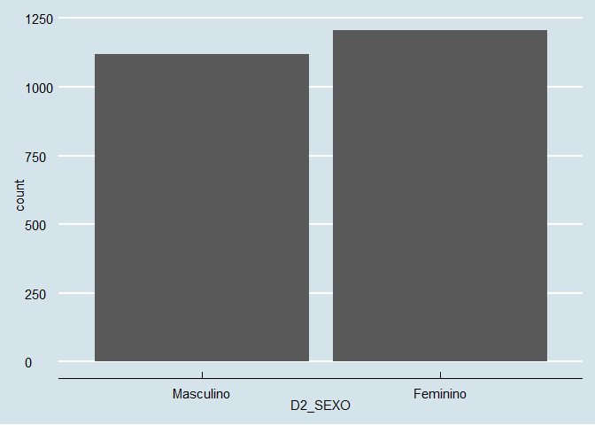
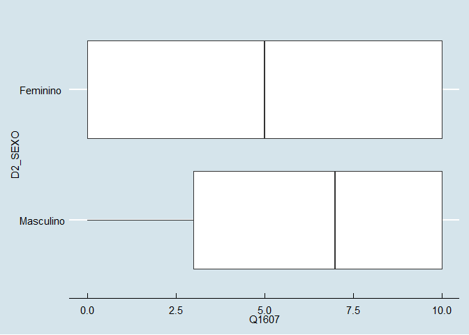
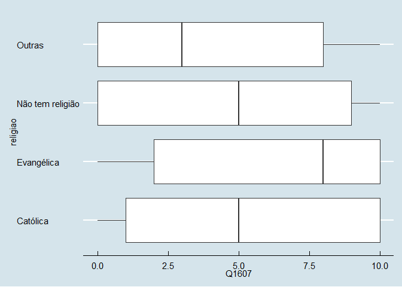

Exercício 8
================
Alune

### Continuaremos com a utilização dos dados do ESEB2018. Carregue o banco da mesma forma que nos exercicios anteriores

``` r
library(tidyverse)
library(haven)
library(scales)
library(dotwhisker)
library(ggthemes)

link <- "https://github.com/MartinsRodrigo/Analise-de-dados/blob/master/04622.sav?raw=true"

download.file(link, "04622.sav", mode = "wb")

banco <- read_spss("04622.sav") 

banco <- banco %>%
  mutate(D2_SEXO = as_factor(D2_SEXO),
         D10 = as_factor(D10)) %>%
  filter(Q1607 < 11)
```

### Começaremos a utilizar no modelo de regressão variáveis qualitativas/categóricas. A primeira delas é sexo (D2\_SEXO). Represente esta variável graficamente.

``` r
ggplot(banco, aes(D2_SEXO)) +
  geom_bar() + theme_economist()
```

<!-- -->

### Represente graficamente a associação entre sexo e nota atribuida a Bolsonaro (Q1607)

``` r
ggplot(banco, aes(Q1607, D2_SEXO)) +
  geom_boxplot() + theme_economist()
```

<!-- -->

### Teste a associação entre sexo e aprovação de Bolsonaro. Qual é sua conclusão?

``` r
t.test(Q1607 ~ D2_SEXO, data = banco)
```

    ## 
    ##  Welch Two Sample t-test
    ## 
    ## data:  Q1607 by D2_SEXO
    ## t = 5.88, df = 2324, p-value = 4.693e-09
    ## alternative hypothesis: true difference in means is not equal to 0
    ## 95 percent confidence interval:
    ##  0.6392909 1.2790608
    ## sample estimates:
    ## mean in group Masculino  mean in group Feminino 
    ##                6.020536                5.061360

Os resultados sugerem que em média respondentes masculinos atribuem nota
6,02 na avaliação de Bolsonaro, enquanto respondentes femininas tendem a
avaliá-lo em média com nota 5,06

### Faça uma regressão bivariada com estas duas variáveis, verificando em que medida sexo explica a nota atribuida a Bolsonaro. Interprete o resultado da regressão (o \(\beta\), o \(\alpha\), p-valores e medidas de desempenho do modelo)

``` r
regressao <- lm (Q1607 ~ D2_SEXO, data = banco)
summary(regressao)
```

    ## 
    ## Call:
    ## lm(formula = Q1607 ~ D2_SEXO, data = banco)
    ## 
    ## Residuals:
    ##     Min      1Q  Median      3Q     Max 
    ## -6.0205 -4.0614 -0.0205  3.9795  4.9386 
    ## 
    ## Coefficients:
    ##                 Estimate Std. Error t value Pr(>|t|)    
    ## (Intercept)       6.0205     0.1178  51.112  < 2e-16 ***
    ## D2_SEXOFeminino  -0.9592     0.1636  -5.863 5.18e-09 ***
    ## ---
    ## Signif. codes:  0 '***' 0.001 '**' 0.01 '*' 0.05 '.' 0.1 ' ' 1
    ## 
    ## Residual standard error: 3.942 on 2324 degrees of freedom
    ## Multiple R-squared:  0.01458,    Adjusted R-squared:  0.01415 
    ## F-statistic: 34.38 on 1 and 2324 DF,  p-value: 5.178e-09

Os resultados mostrados se baseiam no valor feminino do preditor
D2\_SEXO. No caso, pertencer ao gênero feminino pode significar uma
substração de 0,9592 na avalição de Bolsonaro. Ou seja, há uma direção
negativa entre as variávels. A significação estatística do modelo é
satisfatória. Quando o preditor assume o valor “masculino”, a avalição
de Bolsonaro já apresenta uma valor de 6,02. Por fim, o r quadrado é
baixo, com o modelo podendo explicar somente 1% da variação de Q1607.

### Outra variável categórica bastante presente no debate sobre voto na última eleição é religião (D10). Represente esta variável graficamente.

``` r
ggplot(banco, aes(D10)) +
  geom_bar() + theme_economist()
```

<!-- --> \#\#\#
Crie no banco de dados uma variável de religião modificada chamada
`religiao` com as categorias “Evangélica”, “Católica”, “Não tem
religião”, e agregue todas as outras na categoria “Outras”.

``` r
banco <- banco %>%
  mutate(religiao = case_when(
                              D10 == "Católica" ~ "Católica",
                              D10 == "Evangélica" ~ "Evangélica",
                              D10 == "Não tem religião" ~ "Não tem religião", 
                              D10 != "Católica" ~ "Outras",
                              D10 != "Evangélica" ~ "Outras",
                              D10 != "Não tem religião" ~ "Outras"))


ggplot(banco, aes(religiao )) +
  geom_bar() + theme_economist()
```

<!-- -->

### Represente graficamente a associação entre religiao e nota atribuida a Bolsonaro

``` r
ggplot(banco, aes(Q1607, religiao)) +
  geom_boxplot() +  theme_economist()
```

<!-- -->

### Para fazer o teste estatistico da associação entre as variáveis, não podemos usar o teste-t pois neste caso a variável categórica possui diversos níveis. O adequado é utilizar o teste de ANOVA ou o teste de Kruskal. Abaixo ilustramos como fazer esse teste. O Kruskal-test indica se há diferença entre alguma das categorias da variável e a variável contínua, mas não especifica como as diferentes categorias se diferenciam. Isso pode ser obtido com o teste de Wilcox, que compara os agrupamentos par a par. Como você interpreta esse resultado?

``` r
kruskal.test(Q1607 ~ religiao, data = banco)
```

    ## 
    ##  Kruskal-Wallis rank sum test
    ## 
    ## data:  Q1607 by religiao
    ## Kruskal-Wallis chi-squared = 61.013, df = 3, p-value = 3.571e-13

``` r
pairwise.wilcox.test(banco$Q1607, banco$religiao,
                     p.adjust.method = "BH")
```

    ## 
    ##  Pairwise comparisons using Wilcoxon rank sum test with continuity correction 
    ## 
    ## data:  banco$Q1607 and banco$religiao 
    ## 
    ##                  Católica Evangélica Não tem religião
    ## Evangélica       7.4e-06  -          -               
    ## Não tem religião 0.043    8.3e-06    -               
    ## Outras           1.2e-05  4.4e-11    0.126           
    ## 
    ## P value adjustment method: BH

Dado o p-valor baixo, há uma confirmação da correlação entre entre a
variável dependente e o preditor. Os resultados do teste Wilcox indicam
que não existe uma homogeinidade estatística nos casos de cada
categoria. No entanto, em aglumas comparações as diferenças não são tão
dísparas (Não tem religão vS Outras); já em outra ela é mais profunda
(Evangélica vs Outras).

### Faça uma regressão linear para verificar em que medida religião explica a avaliação de Bolsonaro. Interprete o resultado da regressão (cada um dos \(\beta\)s, o \(\alpha\), p-valores e medidas de desempenho do modelo)

``` r
regressao2 <- lm(Q1607 ~ religiao, data = banco)
summary(regressao2)
```

    ## 
    ## Call:
    ## lm(formula = Q1607 ~ religiao, data = banco)
    ## 
    ## Residuals:
    ##    Min     1Q Median     3Q    Max 
    ## -6.259 -4.107  0.559  3.741  5.893 
    ## 
    ## Coefficients:
    ##                          Estimate Std. Error t value Pr(>|t|)    
    ## (Intercept)                5.4410     0.1146  47.470  < 2e-16 ***
    ## religiaoEvangélica         0.8184     0.1838   4.452 8.93e-06 ***
    ## religiaoNão tem religião  -0.6325     0.3081  -2.053   0.0402 *  
    ## religiaoOutras            -1.3339     0.2859  -4.665 3.26e-06 ***
    ## ---
    ## Signif. codes:  0 '***' 0.001 '**' 0.01 '*' 0.05 '.' 0.1 ' ' 1
    ## 
    ## Residual standard error: 3.921 on 2322 degrees of freedom
    ## Multiple R-squared:  0.0261, Adjusted R-squared:  0.02484 
    ## F-statistic: 20.74 on 3 and 2322 DF,  p-value: 2.936e-13

Adotando como “Católico” é variável de referência, cada vez que o
preditor assume o valor “Evangélico” implica em uma eleveção de 0,818 na
avaliação de Bolsonaro. Se a variável independente assumir ovalor “Não
tem religão”, ocorre uma recúo de 0,632 no apio ao candidato. Se o
preditor tiver valor “Outro”, também há uma subtração, no caso de 1,333
na avalição dele. Desses preditores, apenas “Não tem religão” apresenta
significânica estatístia não satisfatória. Nota-se que quando um
respondente católico, a média da avalição de Bolsonaro é de 5,44,
conforme indica o intercepto. Fora “não tem religão”, todos os
preditores apresentam significância estatística, com um p-valor
considerável. Por fim, a julgar pelo valor do r quadrado, o modelo só
consegue explicar cerca de 2% da variação da variável dependente.

### Faça uma regressao linear avaliando ao mesmo tempo em que medida religiao e sexo explicam a avaliacao de Bolsonaro. Interprete o resultado de cada um dos coeficientes a partir da representação gráfica destes.

``` r
regressao3 <- lm(Q1607 ~ religiao + D2_SEXO, data = banco)
summary(regressao3)
```

    ## 
    ## Call:
    ## lm(formula = Q1607 ~ religiao + D2_SEXO, data = banco)
    ## 
    ## Residuals:
    ##     Min      1Q  Median      3Q     Max 
    ## -6.8130 -3.9448  0.1915  3.7365  6.3682 
    ## 
    ## Coefficients:
    ##                          Estimate Std. Error t value Pr(>|t|)    
    ## (Intercept)                5.9493     0.1401  42.477  < 2e-16 ***
    ## religiaoEvangélica         0.8637     0.1825   4.732 2.36e-06 ***
    ## religiaoNão tem religião  -0.6813     0.3057  -2.229   0.0259 *  
    ## religiaoOutras            -1.3130     0.2837  -4.629 3.88e-06 ***
    ## D2_SEXOFeminino           -1.0045     0.1616  -6.215 6.07e-10 ***
    ## ---
    ## Signif. codes:  0 '***' 0.001 '**' 0.01 '*' 0.05 '.' 0.1 ' ' 1
    ## 
    ## Residual standard error: 3.889 on 2321 degrees of freedom
    ## Multiple R-squared:  0.04204,    Adjusted R-squared:  0.04039 
    ## F-statistic: 25.46 on 4 and 2321 DF,  p-value: < 2.2e-16

``` r
dwplot(regressao3,
vline = geom_vline(xintercept = 0, colour = "grey60", linetype = 2))
```

<!-- -->

Com exceção de da variável dummy com o valor “Outras”, todos os outros
preditores apresentam significância estatística. Adotando a varáivel
D2\_SEXO com o valor feminino como variável de controle e “Católico”
como categoria de referência, ser evangélico tender a elevar em 0,863 a
avalição de Bolsonaro, enquanto não professar nenhuma religião diminuu
em 0,613 a avalição dele. Pertencer a nenhuma das cateogri elencadas de
religão também provoca uma redução de 1,33 no apoio a ele. Além disso, a
julgar pelo incercepto, um homem católico geralmente atribui uma
avalição de 5,9 em médio a Bolsonaro.
