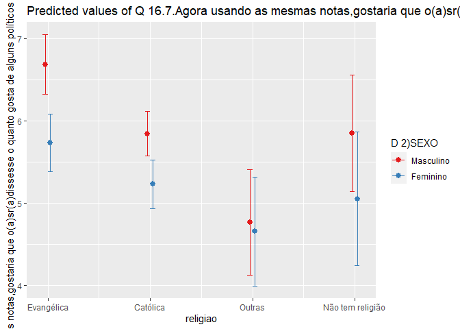

Exercicio 9
================

### Continuaremos com a utilização dos dados do ESEB2018. Carregue o banco da mesma forma que nos exercicios anteriores

``` r
library(tidyverse)
library(haven)
library(scales)
library(sjPlot)

link <- "https://github.com/MartinsRodrigo/Analise-de-dados/blob/master/04622.sav?raw=true"

download.file(link, "04622.sav", mode = "wb")

banco <- read_spss("04622.sav") 

banco <- banco %>%
  mutate(D10 = as_factor(D10)) %>%
  filter(Q1607 < 11, 
         Q18 < 11,
         D9 < 9999998,
         Q1501 < 11)
```

### Crie a mesma variável de religião utilizada no exercício anterior

``` r
Outras <- levels(banco$D10)[-c(3,5,13)]

banco <- banco %>%
  mutate(religiao = case_when(D10 %in% Outras ~ "Outras",
                              D10 == "Católica" ~ "Católica",
                              D10 == "Evangélica" ~ "Evangélica",
                              D10 == "Não tem religião" ~ "Não tem religião"))


ggplot(banco, aes(religiao, ..count../sum(..count..) )) +
  geom_bar() +
  scale_y_continuous(labels = percent)
```

<!-- -->

### Faça uma regressão linear avaliando em que medida as variáveis independentes utilizadas nos exercícios 7 e 8, idade(D1A\_ID), educação (D3\_ESCOLA), renda (D9), nota atribuída ao PT (Q1501), auto-atribuição ideológica (Q18), sexo (D2\_SEXO) e religião (variável criada no passo anterior) explicam a avaliação de Bolsonaro (Q1607), mas com uma interação entre as variáveis religião e sexo. Exiba o resultado da regressão e interprete os valores dos coeficientes \(\beta\)s estimados.

``` r
regressao  <- lm(Q1607 ~ D1A_ID + D3_ESCOLA + D9 + D2_SEXO + religiao + Q1501 + Q18 + religiao:D2_SEXO, data = banco)

options (scipen = 10)
summary(regressao)
```

    ## 
    ## Call:
    ## lm(formula = Q1607 ~ D1A_ID + D3_ESCOLA + D9 + D2_SEXO + religiao + 
    ##     Q1501 + Q18 + religiao:D2_SEXO, data = banco)
    ## 
    ## Residuals:
    ##    Min     1Q Median     3Q    Max 
    ## -8.942 -2.561  0.361  2.303  9.052 
    ## 
    ## Coefficients:
    ##                                     Estimate  Std. Error t value Pr(>|t|)    
    ## (Intercept)                       6.11447301  0.59146502  10.338   <2e-16 ***
    ## D1A_ID                            0.01065374  0.00625539   1.703   0.0888 .  
    ## D3_ESCOLA                        -0.11338330  0.04491403  -2.524   0.0117 *  
    ## D9                               -0.00003632  0.00002768  -1.312   0.1897    
    ## D2_SEXO                          -0.61147553  0.24379852  -2.508   0.0122 *  
    ## religiaoEvangélica                1.18072859  0.61461793   1.921   0.0549 .  
    ## religiaoNão tem religião          0.19859068  1.05853540   0.188   0.8512    
    ## religiaoOutras                   -1.58309059  0.95031319  -1.666   0.0960 .  
    ## Q1501                            -0.39564311  0.02369663 -16.696   <2e-16 ***
    ## Q18                               0.31502274  0.02607173  12.083   <2e-16 ***
    ## D2_SEXO:religiaoEvangélica       -0.34121012  0.38950878  -0.876   0.3812    
    ## D2_SEXO:religiaoNão tem religião -0.18889941  0.69787901  -0.271   0.7867    
    ## D2_SEXO:religiaoOutras            0.50409816  0.60674166   0.831   0.4062    
    ## ---
    ## Signif. codes:  0 '***' 0.001 '**' 0.01 '*' 0.05 '.' 0.1 ' ' 1
    ## 
    ## Residual standard error: 3.297 on 1449 degrees of freedom
    ## Multiple R-squared:  0.3028, Adjusted R-squared:  0.297 
    ## F-statistic: 52.44 on 12 and 1449 DF,  p-value: < 2.2e-16

Os resultados dos coeficientes apontam o seguinte: a avalição de
Bolsonaro, quando todos os preditores têm valor igual a 0, é de 6,1.
Cada acréscimo unitário na variável idade produz um aumento de 0,01 em
Q1607. Por sua vez, a eleveção em uma unidade de escolaridade subtrai
0,1 na avaliação de Bolsonaro. Uma aumento de uma unidadade na renda
produz uma elevação de 0,00003 em Q1607, portanto insignificante. Já o
gênero pode tirar rebaixar Q1607 em 0,6 (Por que não há uma categoria
de referência?).O impacto da religão depende da categoria. Ser
evangêlico dá a Bolsonaro 1,18 na avalição em comparação a um católico,
enquanto, não ter religião garante a ele 0,19 pontos em relação a um
católico. Por outro lado, um respondente da categoria Outras substrai
1,5, em comparação a um católigo, no valor de Q1607. A identificação
ideológica é favorável a ele, posto que adiciona 0,3 na sua avalição.
Por outro lado, cada acréscimo unitária na avaliaão ao PT pode tirar
dele 0,3. Por fim, o impacto da combinação entre D2\_Sexo e religiao
varia conforme a categoria de religião. Quando esta é evangélica, há uma
subtração de 0,3 ma avaliação de Bolsonaro; quando a categoria dessa
variável é “não tem religião”, ocorre um récuo de 0,1 na pontuação dada
a Bolsonaro. Na contramão dessa tendência, estar na categoria Outras
religiões adiciona 0,5 na pontuação atribuída ao ele. Todas essas
coeficientes são registrados em comparada a categoria católicos

### Interprete a significancia estatística dos coeficientes estimados

De acordo com os resultados obtidos, apenas duas váriáveis apresentam
significância estatística, sendo elas: Q1501 e Q18. O peso desses dois
preditoers em comparação aos dos demais fica evidente em razão da
interação entre D2\_SEXO e religiao. Ou seja, eles conseguem monstram
que variáveis de fato são responsáveis explicar a pontuação atribúida a
Bolsonaro.

### Faça um gráfico que mostre a interação entre as duas variáveis. Interprete o resultado apresentado

``` r
plot_model(regressao, type = "pred", 
           terms = c("religiao", "D2_SEXO"), 
           ci.lvl = 0.9)
```

<!-- -->

Os resultados exibidos no gráficos demonstram que: 1) a pontuação
atribuída pelas evangêlicas tende ser menor do que as dos evangêlicos.
Enquanto, os católicos de ambos os gêneros atribuem uma notar menor a
Bolsonaro do que os envagêlicos masculinos. Porém, repete-se a mesma
tendência: mulheres católicas avaliam Bolsonaro com notas menores do que
os homens católicos. Por sua vez, na cateogira Outra, o impacto do
gênero não é profunda, posto que há pouco diferença no intervalo seja
dos respondentes masculinos ou femininos. Finalmnte, o intervalo das
responstas dos que não tem religão de ambos os sexos é mais amplo do que
os demais respondentes. Mas convergência na avalição de homens e
mulheres nessa categoria é a maior do que entre católicos e evangêlicos,
porém menor do que entre Outros
